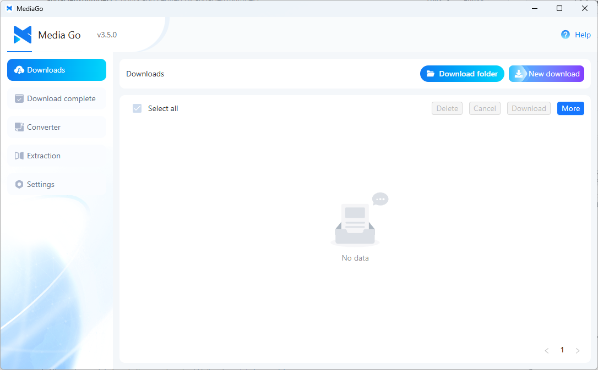
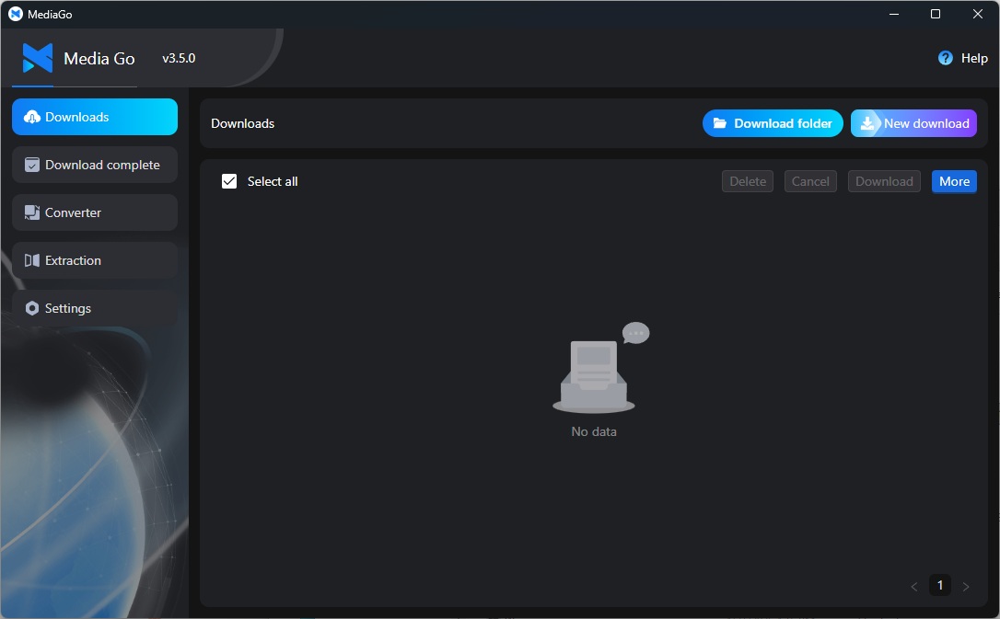
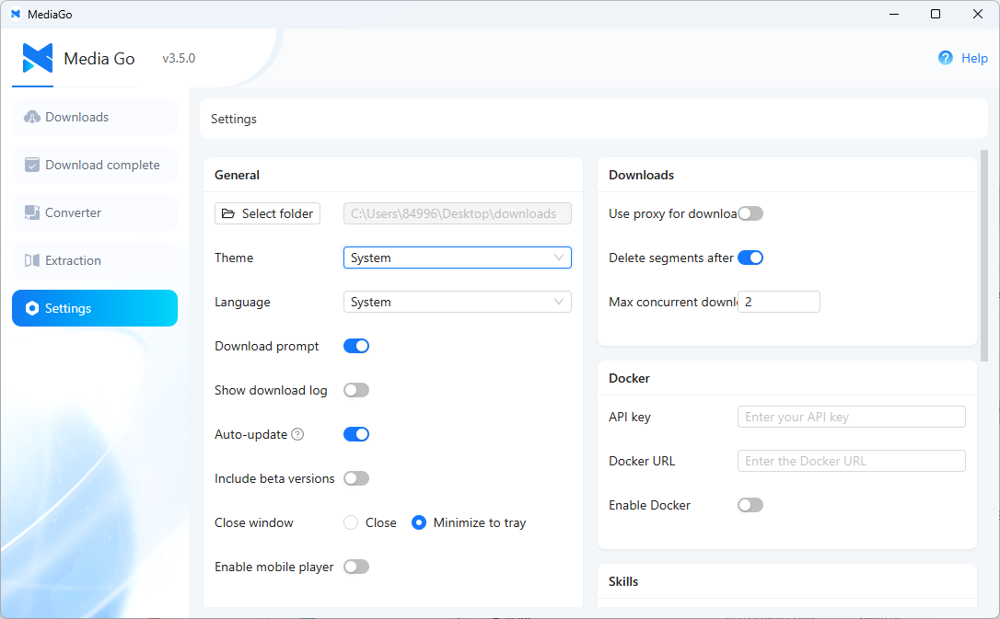
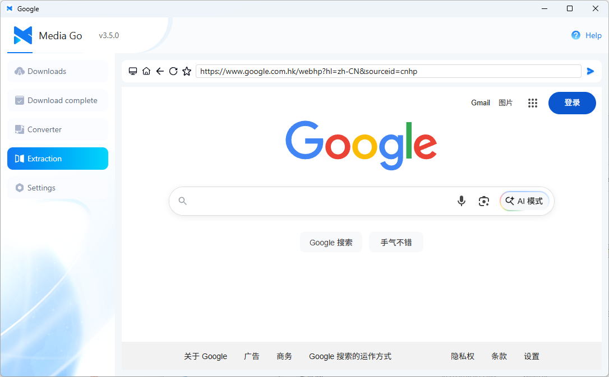

<div align="center">
  <h1>MediaGo</h1>
  <a href="https://downloader.caorushizi.cn/en/guides.html?form=github">Quick Start</a>
  <span>&nbsp;&nbsp;•&nbsp;&nbsp;</span>
  <a href="https://downloader.caorushizi.cn/en?form=github">Website</a>
  <span>&nbsp;&nbsp;•&nbsp;&nbsp;</span>
  <a href="https://downloader.caorushizi.cn/en/documents.html?form=github">Docs</a>
  <span>&nbsp;&nbsp;•&nbsp;&nbsp;</span>
  <a href="https://github.com/caorushizi/mediago/discussions">Discussions</a>
  <span>&nbsp;&nbsp;•&nbsp;&nbsp;</span>
  <a href="https://discord.gg/yxWBVRWGqM">Discord</a>
  <span>&nbsp;&nbsp;•&nbsp;&nbsp;</span>
  <a href="https://www.reddit.com/r/MediaGo_Studio/">Reddit</a>
  <br>

<a href="https://github.com/caorushizi/mediago/blob/master/README.zh.md">中文</a>
<span>&nbsp;&nbsp;•&nbsp;&nbsp;</span>
<a href="https://github.com/caorushizi/mediago/blob/master/README.jp.md">日本語</a>
<span>&nbsp;&nbsp;•&nbsp;&nbsp;</span>
<a href="https://github.com/caorushizi/mediago/blob/master/README.it.md">Italiano</a>
<br>

  <!-- MediaGo Pro -->
  <a href="https://mediago.torchstellar.com/?from=github">
    
  </a>
  <a href="https://mediago.torchstellar.com/?from=github">
    
  </a>
  <br>

  
  
  
  
  
  <br>

  <a href="https://trendshift.io/repositories/11083" target="_blank">
    
  </a>

  <hr />
</div>

A cross-platform video downloader with built-in sniffing — point it at a
page, pick what you want, and save. No packet capture, no browser
extensions to configure, no fiddling with command-line tools.

The app UI currently ships with English, Simplified Chinese, and Italian.

## ✨ What's inside

### 🌐 Browser extension for Chrome / Edge

See something you want on any site → click the extension → send it to
MediaGo. Detects video resources automatically, shows the count on the
toolbar badge, works with most mainstream video platforms including
YouTube, Bilibili and more. Ships bundled with the Desktop app — open
**Settings → More Settings → Browser extension directory** to find the
install folder.

### 🎬 YouTube and 1000+ sites

Powered by yt-dlp under the hood. Supports YouTube, Twitter/X, Instagram,
Reddit and [over a thousand more video sites](https://github.com/yt-dlp/yt-dlp/blob/master/supportedsites.md).

### 🦞 AI assistants can download for you — OpenClaw Skill

Using Claude Code, Cursor or another AI coding assistant? Install the
MediaGo skill and just say _"please download this video: &lt;url&gt;"_.
The AI handles the rest.

```shell
npx clawhub@latest install mediago
```

### 🔌 Works with other tools

MediaGo exposes a full HTTP API — scripts, automation tools and other
apps can create download tasks, query progress and manage the list
directly. The browser extension uses this same API to talk to the desktop
app; anyone else can tap in too.

### 🎞️ Built-in format conversion

After a download finishes, convert it to another format or quality
without leaving MediaGo. No more opening a separate tool for ffmpeg.

### 🐳 One-line Docker deployment

Headless install on your server, then access the web UI from anywhere on
the same network:

```shell
docker run -d --name mediago -p 8899:8899 -v /path/to/mediago:/app/mediago caorushizi/mediago:3.5.0
```

Available on [Docker Hub](https://hub.docker.com/r/caorushizi/mediago) and GHCR (`ghcr.io/caorushizi/mediago`) — same image, pick whichever registry is faster for you. Supports both Intel / AMD (amd64) and ARM (arm64). On the desktop build,
MediaGo listens on both `127.0.0.1` and your LAN IP out of the box, so
phones and tablets on the same Wi-Fi can open the web UI too.

## 📷 Screenshots









## 📥 Download

### v3.5.0 (stable)

- [Windows — installer](https://github.com/caorushizi/mediago/releases/download/v3.5.0/mediago-community-setup-win32-x64-3.5.0.exe)
- [Windows — portable](https://github.com/caorushizi/mediago/releases/download/v3.5.0/mediago-community-portable-win32-x64-3.5.0.exe)
- [macOS — Apple Silicon (arm64)](https://github.com/caorushizi/mediago/releases/download/v3.5.0/mediago-community-setup-darwin-arm64-3.5.0.dmg)
- [macOS — Intel (x64)](https://github.com/caorushizi/mediago/releases/download/v3.5.0/mediago-community-setup-darwin-x64-3.5.0.dmg)
- [Linux (deb)](https://github.com/caorushizi/mediago/releases/download/v3.5.0/mediago-community-setup-linux-amd64-3.5.0.deb)
- [**Docker Hub**](https://hub.docker.com/r/caorushizi/mediago): `docker run -d --name mediago -p 8899:8899 -v /path/to/mediago:/app/mediago caorushizi/mediago:3.5.0`
- **GHCR**: `docker run -d --name mediago -p 8899:8899 -v /path/to/mediago:/app/mediago ghcr.io/caorushizi/mediago:3.5.0`

Browsing older releases? See the [GitHub Releases page](https://github.com/caorushizi/mediago/releases).

### 🪄 One-click Docker deployment via BT Panel

1. Install [BT Panel](https://www.bt.cn/new/download.html?r=dk_mediago) using the official script.
2. Log in to the panel, click **Docker** in the sidebar and finish the
   Docker service setup (just follow the prompts).
3. Find **MediaGo** in the app store, click **Install**, configure your
   domain, and you're done.

## 📝 What's new in v3.5.0

- **🌐 Browser extension** — sniff videos on any site, send to MediaGo
  in one click
- **🎬 YouTube + 1000+ sites** — powered by yt-dlp
- **🦞 OpenClaw Skill** — download videos via AI coding assistants
- **🔌 HTTP API** — integrate with scripts, automation and third-party tools
- **🎞️ In-app format conversion** — choose output format and quality
- **🐳 Simpler Docker deployment** — mount a single folder, multi-arch images on GHCR
- **⚡ Faster startup** — backend rewrite, lower memory footprint, built-in video player

## 🛠️ Built with

[](https://react.dev/)
[](https://www.electronjs.org)
[](https://vitejs.dev)
[](https://www.typescriptlang.org/)
[](https://tailwindcss.com)
[](https://ui.shadcn.com/)
[](https://go.dev/)
[](https://ant.design)

## 🙏 Acknowledgements

- [N_m3u8DL-RE](https://github.com/nilaoda/N_m3u8DL-RE)
- [BBDown](https://github.com/nilaoda/BBDown)
- [yt-dlp](https://github.com/yt-dlp/yt-dlp)
- [aria2](https://aria2.github.io/)
- [mediago-core](https://github.com/caorushizi/mediago-core)

## ⚖️ Disclaimer

> **This project is for educational and research purposes only. Do not use it for any commercial or illegal purposes.**
>
> 1. All code and functionality provided by this project are intended solely as a reference for learning about streaming media technologies. Users must comply with the laws and regulations of their jurisdiction.
> 2. Any content downloaded using this project remains the property of its original copyright holders. Users should delete downloaded content within 24 hours or obtain proper authorization.
> 3. The developers of this project are not responsible for any actions taken by users, including but not limited to downloading copyrighted content or impacting third-party platforms.
> 4. Using this project for mass scraping, disrupting platform services, or any activity that infringes upon the legitimate rights of others is strictly prohibited.
> 5. By using this project you acknowledge that you have read and agree to this disclaimer. If you do not agree, stop using the project and delete it immediately.

---

> Building from source? See [CONTRIBUTING.md](./CONTRIBUTING.md).
>
> Translating MediaGo? See [TRANSLATION.md](./TRANSLATION.md).
