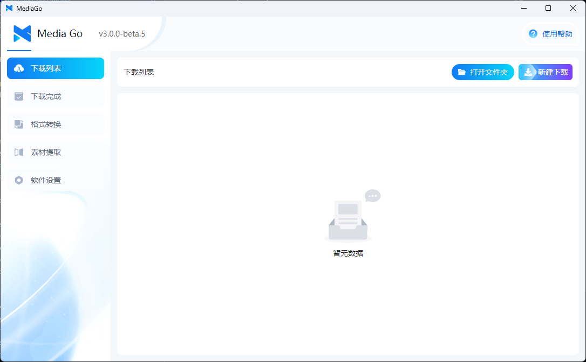
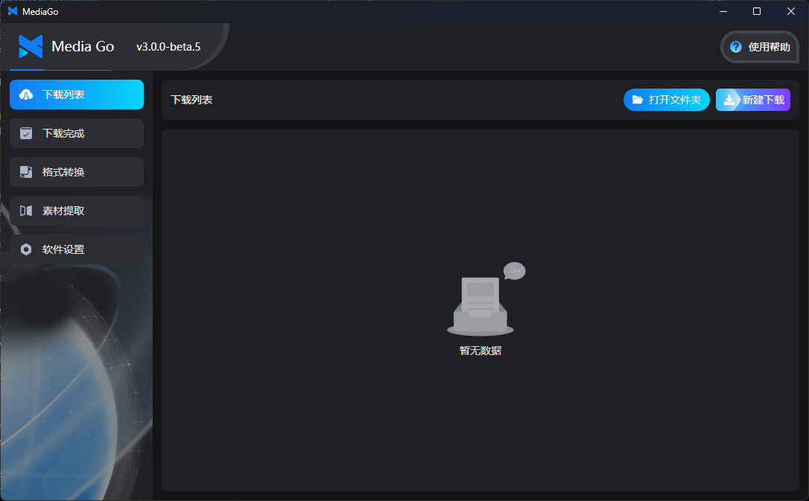
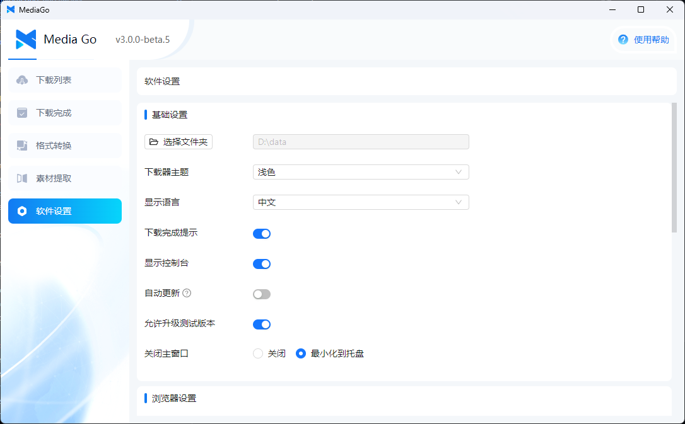
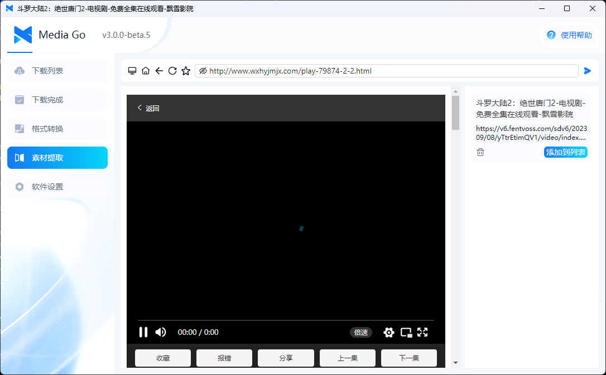

<div align="center">
  <h1>MediaGo</h1>
  <a href="https://downloader.caorushizi.cn/guides.html?form=github">快速开始</a>
  <span>&nbsp;&nbsp;•&nbsp;&nbsp;</span>
  <a href="https://downloader.caorushizi.cn?form=github">官网</a>
  <span>&nbsp;&nbsp;•&nbsp;&nbsp;</span>
  <a href="https://downloader.caorushizi.cn/documents.html?form=github">文档</a>
  <span>&nbsp;&nbsp;•&nbsp;&nbsp;</span>
  <a href="https://github.com/caorushizi/mediago/discussions">Discussions</a>
  <br>

<a href="https://github.com/caorushizi/mediago/blob/master/README.md">English</a>
<span>&nbsp;&nbsp;•&nbsp;&nbsp;</span>
<a href="https://github.com/caorushizi/mediago/blob/master/README.jp.md">日本語</a>
<br>

  <!-- MediaGo Pro 推广 -->
  <a href="https://mediago.torchstellar.com/?from=github">
    
  </a>
  <a href="https://mediago.torchstellar.com/?from=github">
    
  </a>
  <br>

  
  
  
  
  
  <br>

  <a href="https://trendshift.io/repositories/11083" target="_blank">
    
  </a>

  <hr />
</div>

跨平台视频下载器，内置嗅探 —— 打开网页、选一下想要的资源、保存完事。不用抓包、不用折腾浏览器插件、不用面对命令行。

## ✨ 主打功能

### 🌐 浏览器扩展（Chrome / Edge）

浏览网页时遇到想下的视频 → 点扩展图标 → 一键发到 MediaGo。自动识别页面里的可下载资源，工具栏图标显示检测到的数量，主流视频网站（包括 YouTube、Bilibili 等）都能覆盖。扩展随桌面端安装包一起打包，在 **设置 → 更多设置 → 浏览器扩展目录** 就能找到安装文件夹。

### 🎬 支持 YouTube 和 1000+ 站点

底层用的是 yt-dlp。支持 YouTube、Twitter/X、Instagram、Reddit 等 [一千多个视频站点](https://github.com/yt-dlp/yt-dlp/blob/master/supportedsites.md)。

### 🦞 让 AI 助手帮你下载 —— OpenClaw Skill

在用 Claude Code、Cursor 等 AI 编程助手？装上 MediaGo Skill 后直接跟 AI 说"帮我下载这个视频：&lt;链接&gt;"就行，剩下的交给 AI。

```shell
npx clawhub@latest install mediago
```

### 🔌 可以和其他工具联动

MediaGo 提供一整套 HTTP 接口 —— 脚本、自动化工具、其他 App 都能直接调用 MediaGo 创建下载任务、查询进度、管理列表。浏览器扩展就是通过这套接口和桌面端对话的，你也可以接入自己的工作流。

### 🎞️ 内置格式转换

下载完成后可以直接在 MediaGo 里转换格式、选画质，不用再打开别的软件。

### 🐳 Docker 一键部署

服务器端一条命令部署，局域网内任意设备都能打开 Web 界面：

```shell
docker run -d --name mediago -p 8899:8899 -v /path/to/mediago:/app/mediago caorushizi/mediago:3.5.0
```

在 [Docker Hub](https://hub.docker.com/r/caorushizi/mediago) 和 GHCR（`ghcr.io/caorushizi/mediago`）上同步发布 —— 同一份镜像，哪个源更快用哪个。支持 Intel / AMD (amd64) 和 ARM (arm64) 两种架构。桌面版同时监听 `127.0.0.1` 和局域网 IP，同一个 Wi-Fi 下的手机、平板可以直接打开 Web 界面。

## 📷 软件截图









## 📥 下载

### v3.5.0（正式版）

- [Windows — 安装版](https://github.com/caorushizi/mediago/releases/download/v3.5.0/mediago-community-setup-win32-x64-3.5.0.exe)
- [Windows — 便携版](https://github.com/caorushizi/mediago/releases/download/v3.5.0/mediago-community-portable-win32-x64-3.5.0.exe)
- [macOS — Apple Silicon (arm64)](https://github.com/caorushizi/mediago/releases/download/v3.5.0/mediago-community-setup-darwin-arm64-3.5.0.dmg)
- [macOS — Intel (x64)](https://github.com/caorushizi/mediago/releases/download/v3.5.0/mediago-community-setup-darwin-x64-3.5.0.dmg)
- [Linux (deb)](https://github.com/caorushizi/mediago/releases/download/v3.5.0/mediago-community-setup-linux-amd64-3.5.0.deb)
- [**Docker Hub**](https://hub.docker.com/r/caorushizi/mediago)：`docker run -d --name mediago -p 8899:8899 -v /path/to/mediago:/app/mediago caorushizi/mediago:3.5.0`
- **GHCR**：`docker run -d --name mediago -p 8899:8899 -v /path/to/mediago:/app/mediago ghcr.io/caorushizi/mediago:3.5.0`

查看历史版本请移步 [GitHub Releases](https://github.com/caorushizi/mediago/releases)。

### 🪄 宝塔面板一键部署 Docker

1. 安装宝塔面板，前往 [宝塔面板官网](https://www.bt.cn/new/download.html?r=dk_mediago) 选择正式版的脚本下载安装
2. 登录宝塔面板，在菜单栏中点击 **Docker**，首次进入会提示安装 Docker 服务，点击立即安装并按提示完成
3. 在应用商店中找到 **MediaGo**，点击安装，配置域名等基本信息即可

## 📝 v3.5.0 更新要点

- **🌐 浏览器扩展**：任意网站一键嗅探视频、一键发到 MediaGo
- **🎬 YouTube + 1000+ 站点**：集成 yt-dlp
- **🦞 OpenClaw Skill**：通过 AI 编程助手下载视频
- **🔌 开放 HTTP 接口**：接入脚本、自动化工具和其他应用
- **🎞️ 内置格式转换**：选输出格式和画质
- **🐳 Docker 部署简化**：挂载一个目录即可，多架构镜像已迁至 GHCR
- **⚡ 启动更快**：后端重写，资源占用更低，内置视频播放器

## 🛠️ 技术栈

[](https://react.dev/)
[](https://www.electronjs.org)
[](https://vitejs.dev)
[](https://www.typescriptlang.org/)
[](https://tailwindcss.com)
[](https://ui.shadcn.com/)
[](https://go.dev/)
[](https://ant.design)

## 🙏 鸣谢

- [N_m3u8DL-RE](https://github.com/nilaoda/N_m3u8DL-RE)
- [BBDown](https://github.com/nilaoda/BBDown)
- [yt-dlp](https://github.com/yt-dlp/yt-dlp)
- [aria2](https://aria2.github.io/)
- [mediago-core](https://github.com/caorushizi/mediago-core)

## ⚖️ 免责声明

> **本项目仅供学习和研究使用，请勿用于任何商业或非法用途。**
>
> 1. 本项目提供的所有代码和功能仅作为学习流媒体技术的参考，使用者需自行遵守所在地区的法律法规。
> 2. 使用本项目下载的任何内容，其版权归原始内容所有者所有。使用者应在下载后 24 小时内删除，或取得版权方授权。
> 3. 本项目开发者不对使用者的任何行为承担责任，包括但不限于：下载受版权保护的内容、对第三方平台造成的影响等。
> 4. 禁止将本项目用于大规模抓取、破坏平台服务或任何侵犯他人合法权益的行为。
> 5. 使用本项目即表示您已阅读并同意本免责声明。如不同意，请立即停止使用并删除本项目。

---

> 想从源码构建？见 [CONTRIBUTING.md](./CONTRIBUTING.md)（英文）。
>
> 想为 MediaGo 做翻译？见 [TRANSLATION.md](./TRANSLATION.md)（英文）。
