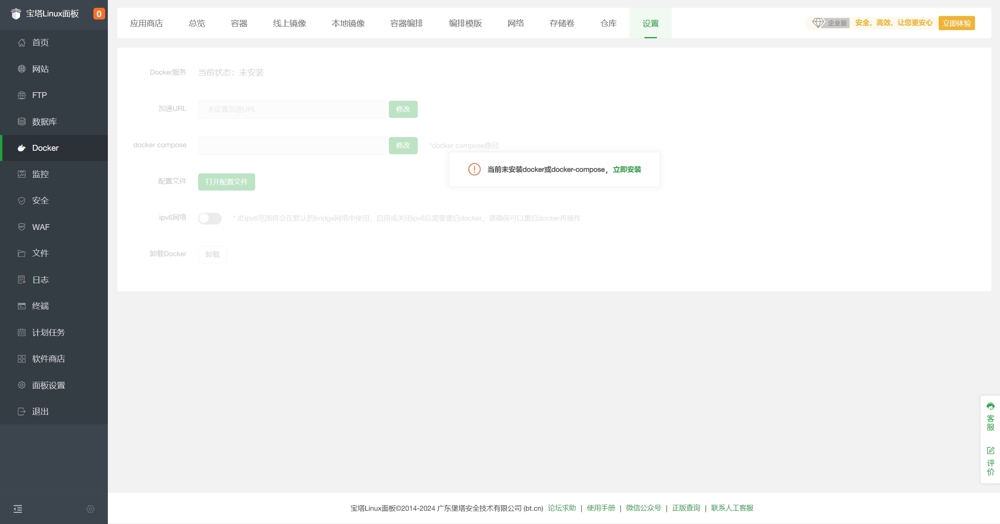

# 通过宝塔面板部署

本文介绍使用 `宝塔面板` 来部署 `MediaGo`。

## 前提

- 仅适用于宝塔面板 9.2.0 及以上版本
- 安装宝塔面板，前往[宝塔面板官网](https://www.bt.cn/new/download.html?r=dk_mediago)，选择正式版的脚本下载安装

## 部署

1. 登录宝塔面板，在左侧菜单栏中点击 `Docker`
  

2. 首次会提示安装 `Docker` 和 `Docker Compose` 服务，点击立即安装，若已安装请忽略。
  

3. 安装完成后在`Docker-应用商店`中找到 `MediaGo`，点击`安装`
  

4. 提交后面板会自动进行应用初始化，大概需要1-3分钟，初始化完成后即可访问。

- 端口： 8899
- 版本选择： v3.0.0

## 访问 MediaGo

请在浏览器地址栏中输入域名访问 `http://<宝塔面板IP>:8899`，即可访问 `MediaGo` 控制台。
