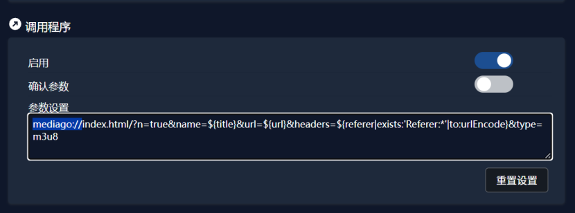
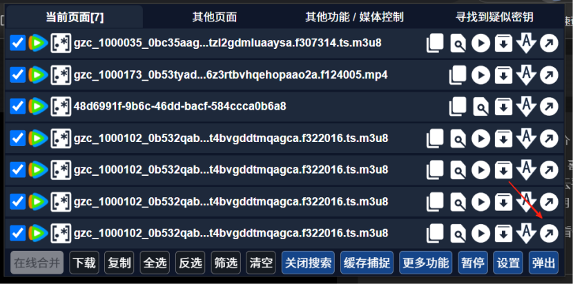

# 配合猫爪下载视频

::: tip
感谢 `1颗温暖的心` 提供教程：
<https://www.kdocs.cn/l/coioFy5l7vwW>
:::

- 安装 [猫爪](https://github.com/xifangczy/cat-catch) 最新版
- 在设置中添加调用程序：

  `mediago://index.html/?n=true&name=${title}&url=${url}&headers=${referer|exists:'Referer:*'|to:urlEncode}&type=m3u8&silent=true`

  

- 设置完成之后可以在猫爪的面板中点击直接调用 MediaGo 下载

  
