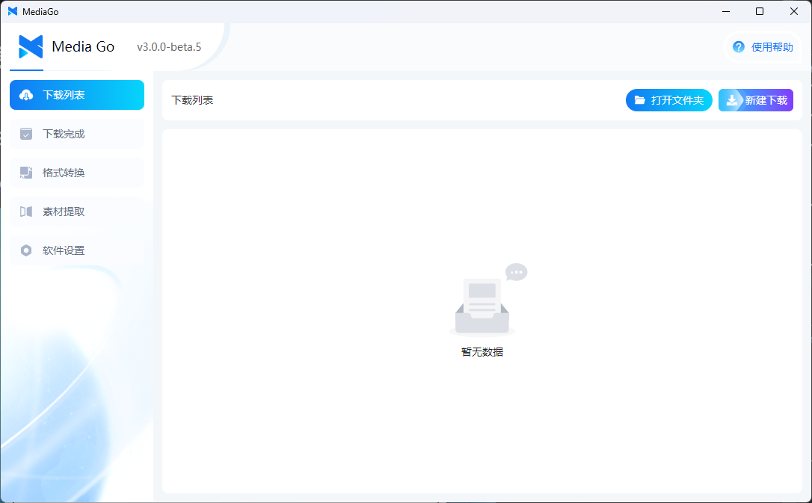
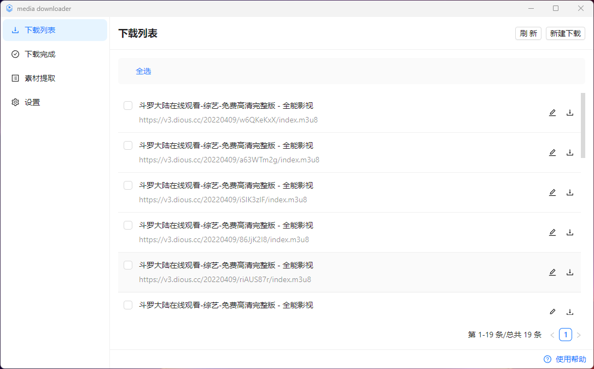
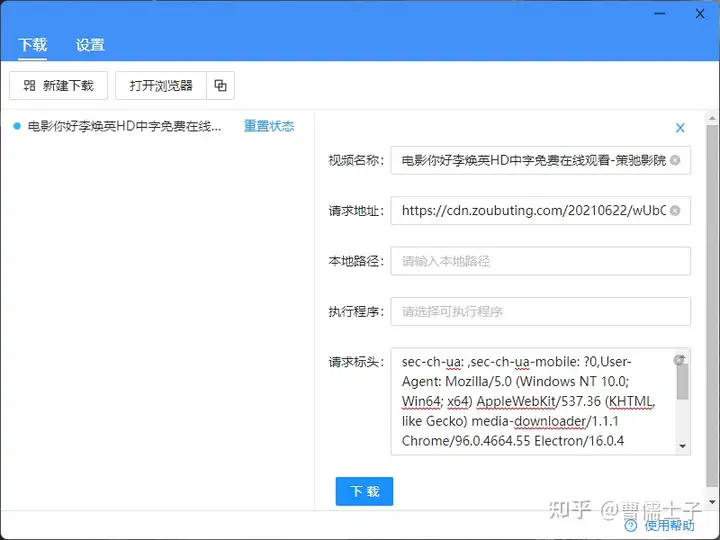
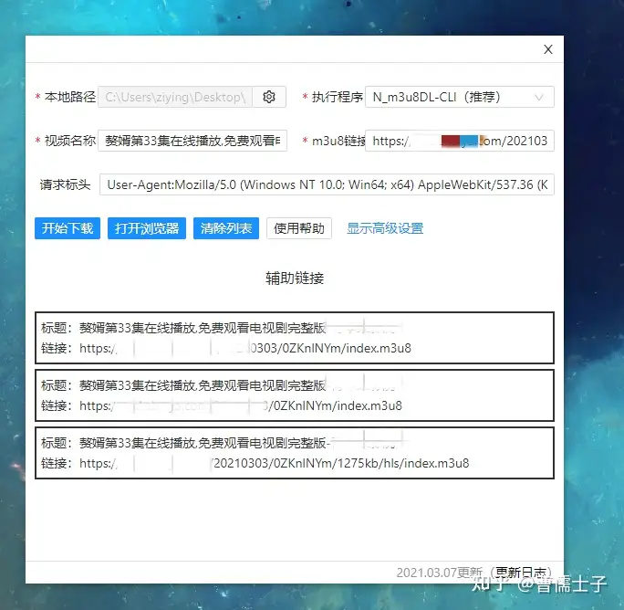

# 更新日志

## v3.0.0 (2024.10.7 发布)

### 软件下载

- [【mediago】 windows(安装版) v3.0.0](https://github.com/caorushizi/mediago/releases/download/v3.0.0/mediago-setup-win32-x64-3.0.0.exe)
- [【mediago】 windows(便携版) v3.0.0](https://github.com/caorushizi/mediago/releases/download/v3.0.0/mediago-portable-win32-x64-3.0.0.exe)
- [【mediago】 macos arm64（apple 芯片） v3.0.0](https://github.com/caorushizi/mediago/releases/download/v3.0.0/mediago-setup-darwin-arm64-3.0.0.dmg)
- [【mediago】 macos x64（intel 芯片） v3.0.0](https://github.com/caorushizi/mediago/releases/download/v3.0.0/mediago-setup-darwin-x64-3.0.0.dmg)
- [【mediago】 linux v3.0.0](https://github.com/caorushizi/mediago/releases/download/v3.0.0/mediago-setup-linux-amd64-3.0.0.deb)
- 【mediago】 docker v3.0 `docker run -d --name mediago -p 8899:8899 -v /root/mediago:/root/mediago registry.cn-beijing.aliyuncs.com/caorushizi/mediago:v3.0.0`

### 国内下载

- [【mediago】 windows(安装版) v3.0.0](https://static.ziying.site/mediago/mediago-setup-win32-x64-3.0.0.exe)
- [【mediago】 windows(便携版) v3.0.0](https://static.ziying.site/mediago/mediago-portable-win32-x64-3.0.0.exe)
- [【mediago】 macos arm64（apple 芯片） v3.0.0](https://static.ziying.site/mediago/mediago-setup-darwin-arm64-3.0.0.dmg)
- [【mediago】 macos x64（intel 芯片） v3.0.0](https://static.ziying.site/mediago/mediago-setup-darwin-x64-3.0.0-beta.5.dmg)
- [【mediago】 linux v3.0.0](https://static.ziying.site/mediago/mediago-setup-linux-amd64-3.0.0.deb)
- 【mediago】 docker v3.0 `docker run -d --name mediago -p 8899:8899 -v /root/mediago:/root/mediago registry.cn-beijing.aliyuncs.com/caorushizi/mediago:v3.0.0`

### 软件截图

### 重要更新

- 支持 docker 部署 web 端
- 更新桌面端 UI

### 更新日志

- 更新桌面端 UI
- 支持 docker 部署 web 端
- 新增视频播放，支持桌面端和移动端播放
- 修复 mac 打开无法展示界面的问题
- 优化了批量下载的交互
- 添加了 windows 的便携版（免安装哦）
- 优化了下载列表，支持页面中多个视频的嗅探
- 支持收藏列表手动导入导出
- 支持首页下载列表导出
- 优化了【新建下载】表单的交互逻辑
- 支持 UrlScheme 打开应用，并添加下载任务
- 修复了一些 bug 并提升用户体验

## v2.2.3 (2024.7.06 发布)

### 下载链接

- [windows mediago v2.2.3](https://github.com/caorushizi/mediago/releases/download/v2.2.3/mediago-setup-x64-2.2.3.exe)
- [macos mediago v2.2.3](https://github.com/caorushizi/mediago/releases/download/v2.2.3/mediago-setup-x64-2.2.3.dmg)
- [linux mediago v2.2.3](https://github.com/caorushizi/mediago/releases/download/v2.2.3/mediago-setup-arm64-2.2.3.dmg)

### 更新日志

- 设置中添加【自动更新】开关：仅更新 release 版本，beta 版本不会自动更新
- 下载表单中增加【批量更新】
- 新增 Linux 版本发布
- 载时自动选择清晰度最高的视频
- 新增【清空缓存】&【无痕模式】
- 自定义选择安装位置
- 修复了一些 bug

## v2.2.0 (2024.5.22 发布)

### 下载链接

- [windows mediago v2.2.0](https://github.com/caorushizi/mediago/releases/download/v2.2.0/mediago-setup-2.2.0.exe)
- [macos mediago v2.2.0](https://github.com/caorushizi/mediago/releases/download/v2.2.0/mediago-setup-2.2.0.dmg)

### 更新日志

- 支持下载直播流
- 支持哔哩哔哩视频下载
- 优化沉浸式嗅探流程
- 支持下载控制台输出
- 修复了一些 bug

## v2.0.1（2023.7.1 发布）

### 下载链接

- [windows mediago v2.0.1](https://github.com/caorushizi/mediago/releases/download/v2.0.1/media-downloader-setup-2.0.1.exe)
- [macos mediago v2.0.1](https://github.com/caorushizi/mediago/releases/download/v2.0.1/media-downloader-setup-2.0.1.dmg)

### 软件截图

### 更新日志

- 暗黑模式
- 更多下载配置
- 支持请求标头自动带入
- 支持开启广告过滤
- 支持开启沉浸式嗅探
- 支持切换手机和 PC 模式
- 支持修改同时下载数量
- 修复了一些 bug

## v1.1.5（2022.2.5 发布）

### 下载链接

- [windows mediago v1.1.5](https://github.com/caorushizi/mediago/releases/download/1.1.5/media-downloader-setup-1.1.4.exe)

### 软件截图

### 更新日志

- 支持视频下载

## v1.0.1（2021.3.1 发布）

### 软件截图

### 更新日志

- 支持视频下载
