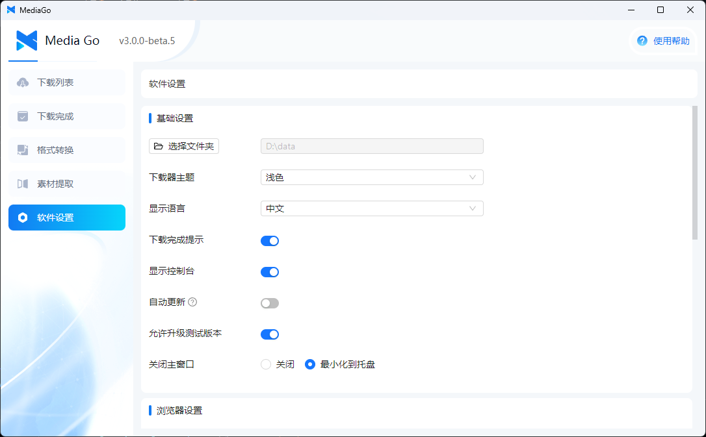
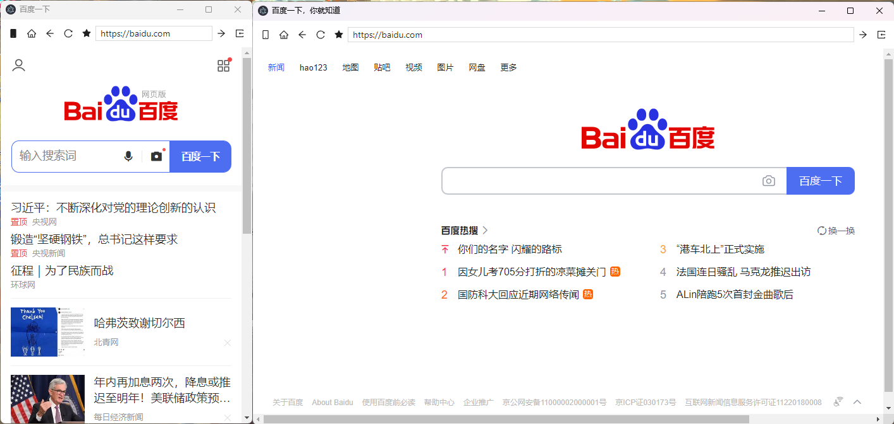

# 使用说明

这个页面主要讲解的是设置页面的参数的含义

## 基础设置

::: tip
下载器全局设置
:::

### 1. 选择文件夹

视频下载的路径

### 2. 下载器主题

支持浅色和深色模式

### 3. 显示语言、

支持中文和英文

### 4. 下载完成提示

开启之后下载完成会出现系统提示

### 5. 显示控制台

开启之后会显示下载的控制台

### 6. 自动更新

开启之后软件会自动检查更新

### 7. 允许升级测试版本

开启之后软件会自动检查测试版本

### 8. 关闭主窗口

控制关闭主窗口后软件会【隐藏到系统托盘】还是【退出软件】

## 浏览器设置

::: tip
浏览器窗口相关的设置
:::

### 1. 在新窗口中打开浏览器

开启了之后浏览器页面会独立出一个窗口

   

### 2. 代理设置

填写自己的代理地址

### 3. 代理开关

打开开关后 **浏览器** 默认会走填写的代理地址，如果代理地址这个开关是打不开的

### 4. 开启广告过滤

打开开关后会过滤页面中的广告

### 5. 以手机模式进入

打开后会将浏览器伪装成手机浏览器，请求移动端的站点（左侧是开启手机模式的截图）

  

### 6. 使用沉浸式嗅探

- 打开状态： 从浏览器中嗅探到的资源不会自动添加到下载列表，需要手动点击页面中的【添加到列表】按钮

  

- 关闭状态： 浏览器中嗅探到的资源会自动添加到下载列表

### 7. 隐私模式： 打开后软件不会保存用户的浏览记录

  

### 8. 更多操作

- 清空缓存： 清空软件的缓存
- 导出收藏【导入收藏】： 导出软件的收藏

## 下载设置

::: tip
和下载相关的设置
:::

### 1. 下载代理开关

打开开关后 **下载器** 默认会走填写的代理地址，【浏览器】和【下载器】的代理是独立的

### 2. 下载完成删除分片

开启后下载完成后会将分片文件删除

### 3. 最大同时下载数量

最多同时可以下载多少视频文件，目前最大是 10，最小是 1

### 4. 更多操作

- 配置文件目录： 软件数据库路径、日志等等路径
- 可执行文件目录： 下载器二进制文件的路径
- 本地存储路径： 下载视频的本地路径

### 5. 当前版本

当前软件版本信息
