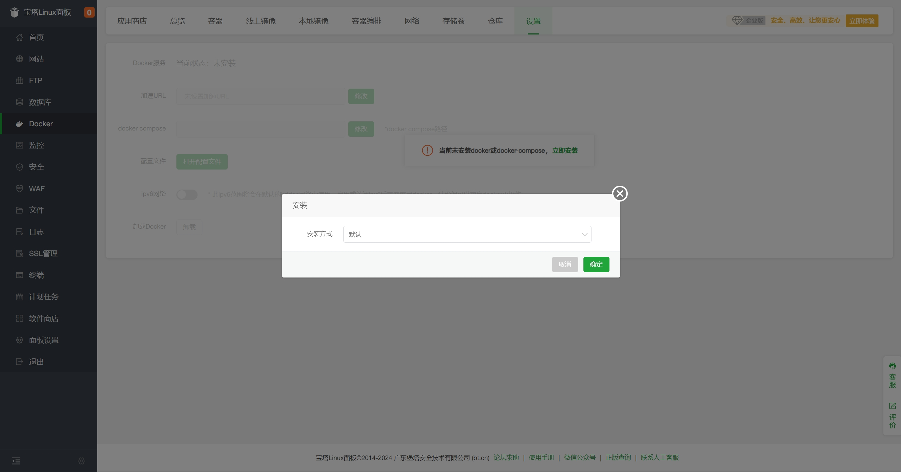
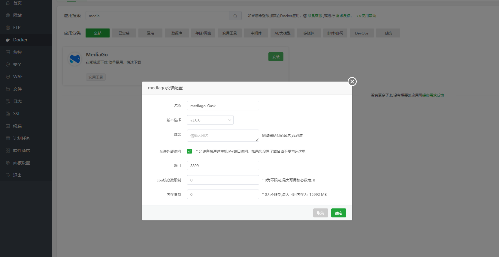

# Deploying with BT Panel

This document introduces how to deploy `MediaGo` using the `BT Panel`.

## Prerequisites

- Only applicable for BT Panel version 9.2.0 and above
- Install BT Panel by visiting the [official BT Panel website](https://www.bt.cn/new/download.html?r=dk_mediago), select the stable version script for installation

## Deployment

1. Log in to the BT Panel and click on `Docker` in the left menu  
   

2. The first time, it will prompt to install `Docker` and `Docker Compose` services. Click "Install Now", and ignore if already installed.  
   

3. After installation, go to `Docker - App Store`, find `MediaGo`, and click `Install`  
   

4. After submission, the panel will automatically initialize the application, which may take 1-3 minutes. Once initialization is complete, you can access it.

- Port: 8899
- Version: v3.0.0

## Access MediaGo

Enter the domain in the browser address bar to access `http://<BT Panel IP>:8899` to open the `MediaGo` console.
