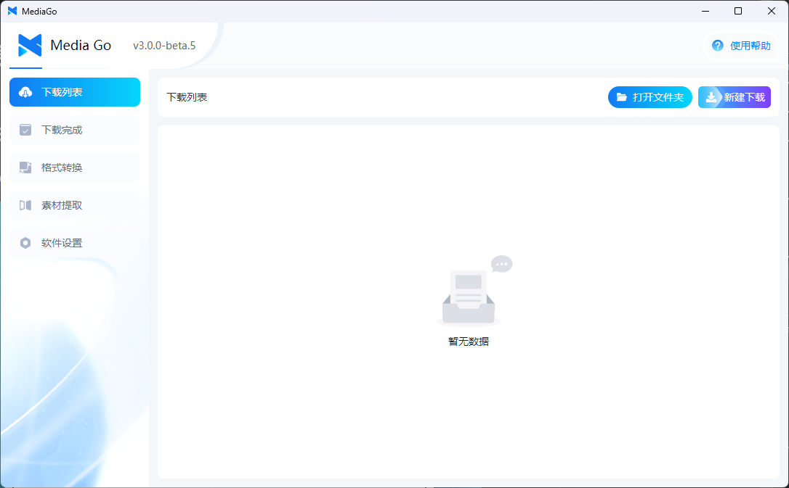
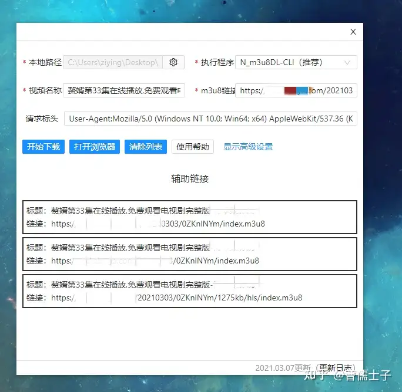

# Changelog

## v3.0.0 (Released on 2024.10.7)

### Software Downloads

- [【mediago】 Windows (Installer) v3.0.0](https://github.com/caorushizi/mediago/releases/download/v3.0.0/mediago-setup-win32-x64-3.0.0.exe)
- [【mediago】 Windows (Portable) v3.0.0](https://github.com/caorushizi/mediago/releases/download/v3.0.0/mediago-portable-win32-x64-3.0.0.exe)
- [【mediago】 macOS ARM64 (Apple Chip) v3.0.0](https://github.com/caorushizi/mediago/releases/download/v3.0.0/mediago-setup-darwin-arm64-3.0.0.dmg)
- [【mediago】 macOS x64 (Intel Chip) v3.0.0](https://github.com/caorushizi/mediago/releases/download/v3.0.0/mediago-setup-darwin-x64-3.0.0.dmg)
- [【mediago】 Linux v3.0.0](https://github.com/caorushizi/mediago/releases/download/v3.0.0/mediago-setup-linux-amd64-3.0.0.deb)
- 【mediago】 Docker v3.0 `docker run -d --name mediago -p 8899:8899 -v /root/mediago:/root/mediago registry.cn-beijing.aliyuncs.com/caorushizi/mediago:v3.0.0`

### Domestic Downloads

- [【mediago】 Windows (Installer) v3.0.0](https://static.ziying.site/mediago/mediago-setup-win32-x64-3.0.0.exe)
- [【mediago】 Windows (Portable) v3.0.0](https://static.ziying.site/mediago/mediago-portable-win32-x64-3.0.0.exe)
- [【mediago】 macOS ARM64 (Apple Chip) v3.0.0](https://static.ziying.site/mediago/mediago-setup-darwin-arm64-3.0.0.dmg)
- [【mediago】 macOS x64 (Intel Chip) v3.0.0](https://static.ziying.site/mediago/mediago-setup-darwin-x64-3.0.0-beta.5.dmg)
- [【mediago】 Linux v3.0.0](https://static.ziying.site/mediago/mediago-setup-linux-amd64-3.0.0.deb)
- 【mediago】 Docker v3.0 `docker run -d --name mediago -p 8899:8899 -v /root/mediago:/root/mediago registry.cn-beijing.aliyuncs.com/caorushizi/mediago:v3.0.0`

### Software Screenshots

### Key Updates

- Support for Docker deployment of the web version
- Updated desktop UI

### Changelog

- Updated desktop UI
- Support for Docker deployment of the web version
- Added video playback, supporting both desktop and mobile playback
- Fixed issue where Mac version wouldn't display the interface
- Optimized batch download interaction
- Added portable version for Windows (no installation required)
- Optimized download list to support sniffing multiple videos on the same page
- Supported manual import/export of favorite lists
- Supported export of the homepage download list
- Optimized interaction logic for the "New Download" form
- Supported opening the app via UrlScheme and adding download tasks
- Fixed several bugs and improved user experience

## v2.2.3 (Released on 2024.7.06)

### Download Links

- [Windows mediago v2.2.3](https://github.com/caorushizi/mediago/releases/download/v2.2.3/mediago-setup-x64-2.2.3.exe)
- [macOS mediago v2.2.3](https://github.com/caorushizi/mediago/releases/download/v2.2.3/mediago-setup-x64-2.2.3.dmg)
- [Linux mediago v2.2.3](https://github.com/caorushizi/mediago/releases/download/v2.2.3/mediago-setup-arm64-2.2.3.dmg)

### Changelog

- Added an "Auto Update" toggle in settings: only release versions will be updated automatically, beta versions will not
- Added "Bulk Update" in the download form
- New Linux version released
- Automatically selects the highest video quality during download
- Added "Clear Cache" and "Incognito Mode"
- Custom installation location selection
- Fixed several bugs

## v2.2.0 (Released on 2024.5.22)

### Download Links

- [Windows mediago v2.2.0](https://github.com/caorushizi/mediago/releases/download/v2.2.0/mediago-setup-2.2.0.exe)
- [macOS mediago v2.2.0](https://github.com/caorushizi/mediago/releases/download/v2.2.0/mediago-setup-2.2.0.dmg)

### Changelog

- Support for live stream downloads
- Support for Bilibili video downloads
- Optimized immersive sniffing process
- Support for console output during download
- Fixed several bugs

## v2.0.1 (Released on 2023.7.1)

### Download Links

- [Windows mediago v2.0.1](https://github.com/caorushizi/mediago/releases/download/v2.0.1/media-downloader-setup-2.0.1.exe)
- [macOS mediago v2.0.1](https://github.com/caorushizi/mediago/releases/download/v2.0.1/media-downloader-setup-2.0.1.dmg)

### Software Screenshots

### Changelog

- Dark mode
- More download configurations
- Support for automatic header injection
- Support for enabling ad filtering
- Support for immersive sniffing
- Support for switching between mobile and PC modes
- Support for modifying simultaneous download limits
- Fixed several bugs

## v1.1.5 (Released on 2022.2.5)

### Download Links

- [Windows mediago v1.1.5](https://github.com/caorushizi/mediago/releases/download/1.1.5/media-downloader-setup-1.1.4.exe)

### Software Screenshots

### Changelog

- Support for video downloads

## v1.0.1 (Released on 2021.3.1)

### Software Screenshots

### Changelog

- Support for video downloads
