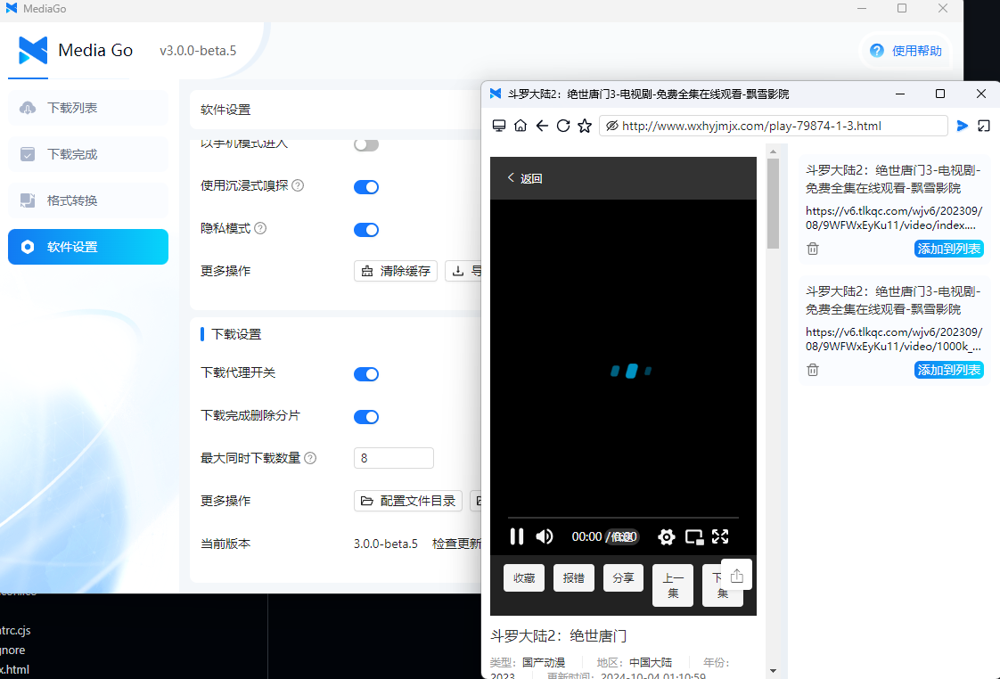
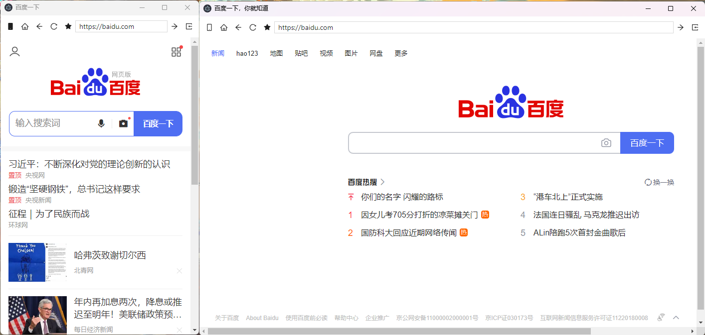
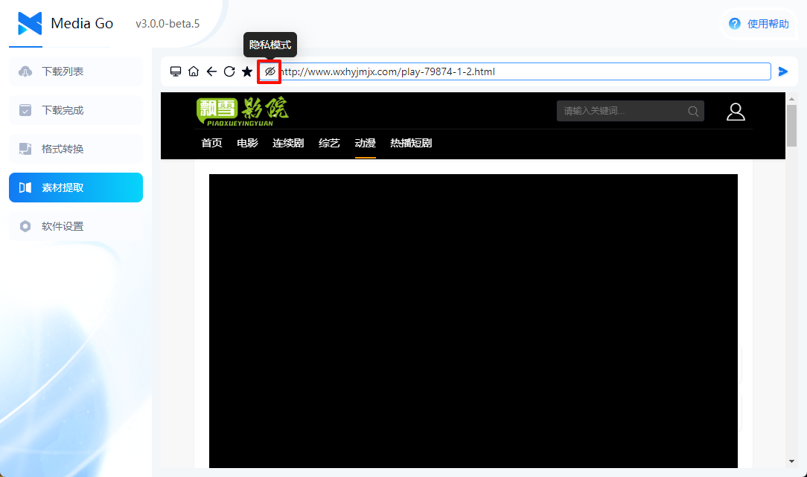
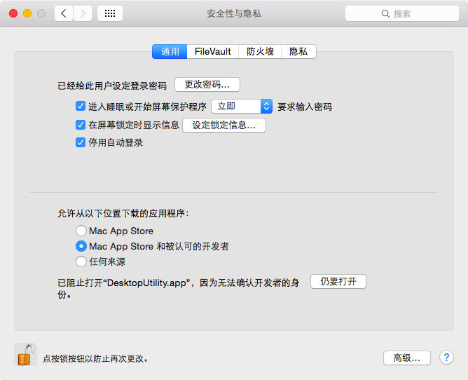

# User Guide

This page mainly explains the meaning of the parameters in the settings page.

## Basic Settings

::: tip
Global settings for the downloader
:::

### 1. Choose Folder

The path for downloading videos.

### 2. Downloader Theme

Supports light and dark modes.

### 3. Display Language

Supports Chinese and English.

### 4. Download Completion Notification

When enabled, the system will show a notification once the download is complete.

### 5. Show Console

When enabled, the download console will be displayed.

### 6. Auto Update

When enabled, the software will automatically check for updates.

### 7. Allow Testing Version Upgrades

When enabled, the software will automatically check for testing versions.

### 8. Close Main Window

Controls whether the software should "hide to the system tray" or "exit the software" when the main window is closed.

## Browser Settings

::: tip
Settings related to the browser window
:::

### 1. Open Browser in a New Window

When enabled, the browser page will open in a separate window.

   

### 2. Proxy Settings

Fill in your own proxy address.

### 3. Proxy Switch

When enabled, the **browser** will use the proxy address you entered. If the proxy switch is disabled, this setting will not be available.

### 4. Enable Ad Blocking

When enabled, the ads on the page will be filtered.

### 5. Use Mobile Mode

When enabled, the browser will mimic a mobile browser and request the mobile version of the site (on the left is the screenshot with mobile mode enabled).

  

### 6. Use Immersive Sniffing

- **Enabled**: Resources sniffed from the browser will not automatically be added to the download list, you need to manually click the "Add to List" button on the page.

  

- **Disabled**: Resources sniffed from the browser will automatically be added to the download list.

### 7. Privacy Mode: When enabled, the software will not save your browsing history

  

### 8. More Operations

- Clear Cache: Clears the software cache.
- Export Favorites [Import Favorites]: Export the software's favorites.

## Download Settings

::: tip
Settings related to downloads
:::

### 1. Download Proxy Switch

When enabled, the **downloader** will use the proxy address you entered. The proxy settings for the **browser** and **downloader** are independent.

### 2. Delete Part Files After Download Completion

When enabled, part files will be deleted after the download is complete.

### 3. Maximum Simultaneous Downloads

Controls how many video files can be downloaded at the same time. The maximum is 10, and the minimum is 1.

### 4. More Operations

- Configuration File Directory: The path to the software's database, logs, etc.
- Executable File Directory: The path to the downloader's binary files.
- Local Storage Path: The local path where downloaded videos are stored.

### 5. Current Version

Displays the current version of the software.

## Other Issues

### Q: About Live Stream Downloads

A: The software supports live stream downloads. Currently, the software doesn't have a reliable method to differentiate live streams, so all download consoles will be enabled. Users need to manually select the data source to download.

### Q: About macOS Version

A: For **Intel chips**, you need to install the x64 version from the release.

After installation, you need to open the app from unidentified developers in macOS Security Settings.  

For **Apple chips**, you need to install the arm64 version from the release.

After installation, execute the command `sudo xattr -dr com.apple.quarantine /Applications/mediago.app` in the console.

### Q: About Old Versions

A: The version 1.1.5 was released quite a while ago and has been verified by many users to be stable. If you want to use the old version, please visit [this link](/history.html).

### Q: About Win7 Users

A: Versions after v2.0.0 no longer support Win7. If you need to use the software on Win7, please download version 1.1.5. For 32-bit systems, the software is currently not supported by default.
