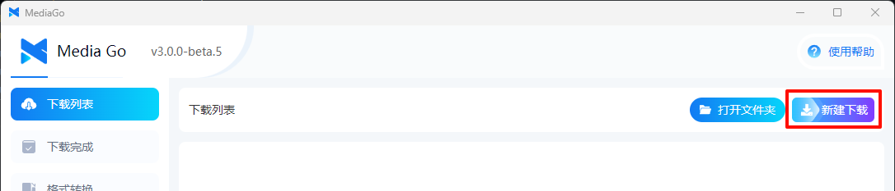

# Quick Start

This article provides a simple guide to help you get started with using the software.

::: tip
To facilitate communication and feedback, you can join the feedback group:

MediaGo QQ Feedback Group 1: 574209001
:::

::: info

v3.0 is the latest version. Please feel free to provide feedback within version 3.0, and we will address it as soon as possible.

:::

## Download and Installation

### v3.0.0 (Released on October 7, 2024)

#### Software Download

- [【mediago】 Windows (Installer) v3.0.0](https://github.com/caorushizi/mediago/releases/download/v3.0.0/mediago-setup-win32-x64-3.0.0.exe)
- [【mediago】 Windows (Portable) v3.0.0](https://github.com/caorushizi/mediago/releases/download/v3.0.0/mediago-portable-win32-x64-3.0.0.exe)
- [【mediago】 macOS arm64 (Apple Silicon) v3.0.0](https://github.com/caorushizi/mediago/releases/download/v3.0.0/mediago-setup-darwin-arm64-3.0.0.dmg)
- [【mediago】 macOS x64 (Intel) v3.0.0](https://github.com/caorushizi/mediago/releases/download/v3.0.0/mediago-setup-darwin-x64-3.0.0.dmg)
- [【mediago】 Linux v3.0.0](https://github.com/caorushizi/mediago/releases/download/v3.0.0/mediago-setup-linux-amd64-3.0.0.deb)
- 【mediago】 Docker v3.0 `docker run -d --name mediago -p 8899:8899 -v /root/mediago:/root/mediago registry.cn-beijing.aliyuncs.com/caorushizi/mediago:v3.0.0`

#### Important Updates

- Support for Docker deployment of the web version.
- Updated desktop UI.

#### Changelog

- Support for Docker deployment of the web version.
- Updated desktop UI.
- Added video playback, supporting both desktop and mobile versions.
- Fixed an issue where macOS could not display the interface.
- Optimized the interaction for batch downloads.
- Added a portable version for Windows (no installation required).
- Optimized the download list, supporting sniffing of multiple videos on a page.
- Supports manual import/export of the favorite list.
- Supports export of the homepage download list.
- Optimized the interaction logic for the "New Download" form.
- Supports UrlScheme to open the app and add download tasks.
- Fixed some bugs and improved the user experience.

## Operation Instructions

### Automatic Video Sniffing

1. Select "Resource Extraction"

   

2. Enter the video URL

   

3. Click "Start Download" to begin downloading the video

   

### Manual Download

1. Click the "New Download" button at the top right of the page

   

2. In the new download window, enter the "Video Name" and the "Stream (m3u8)" or "Bilibili" link

   

3. Click to download the video from the list

   

### Batch Download

   

### Additional Features

1. Convert to Audio

   

2. More features will be added in the future. Stay tuned!

### Video Playback

- PC Playback

     

- Mobile Playback

     

## Start Downloading Your Videos

It's so simple! Go ahead and download your videos now.

::: warning
This software is for learning and communication purposes only.
:::
