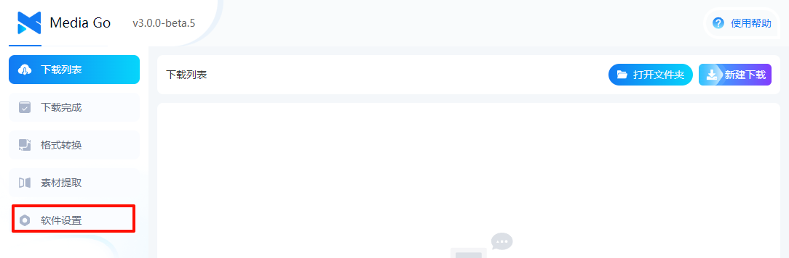

# 快速开始

这篇文章是软件的简单说明，可以快速上手使用本软件。

::: tip
方便大家一起沟通交流， 可以加入反馈群：

MediaGo QQ反馈群 1： 574209001

MediaGo QQ反馈群 2： 921619626

MediaGo 微信反馈群：[评论区查看](/guides.html#waline)
:::

::: info

v3.0 是最新版本，大家的意见可以尽量在 3.0 版本中提出，我们会尽快修复。

:::

## 下载安装

### v3.0.0 (2024.10.7 发布)

#### 软件下载

- [【mediago】 windows x64 v2.2.3](https://github.com/caorushizi/mediago/releases/download/v2.2.3/mediago-setup-x64-2.2.3.exe)
- [【mediago】 macos arm64 v2.2.3](https://github.com/caorushizi/mediago/releases/download/v2.2.3/mediago-setup-x64-2.2.3.dmg)
- [【mediago】 macos x64 v2.2.3](https://github.com/caorushizi/mediago/releases/download/v2.2.3/mediago-setup-x64-2.2.3.dmg)
- [【mediago】 linux x64 v2.2.3](https://github.com/caorushizi/mediago/releases/download/v2.2.3/mediago-setup-arm64-2.2.3.dmg)
- 【mediago】 docker v3.0 `docker run`

#### 重要更新

- 支持 docker 部署 web 端
- 更新桌面端 UI

#### 更新日志

- 支持 docker 部署 web 端
- 更新桌面端 UI
- 新增视频播放，支持桌面端和移动端播放
- 修复 mac 打开无法展示界面的问题
- 优化了批量下载的交互
- 添加了 windows 的便携版（免安装哦）
- 优化了下载列表，支持页面中多个视频的嗅探
- 支持收藏列表手动导入导出
- 支持首页下载列表导出
- 优化了【新建下载】表单的交互逻辑
- 支持 UrlScheme 打开应用，并添加下载任务
- 修复了一些 bug 并提升用户体验

## 操作说明

### 视频自动嗅探

1. 选择【资源提取】

   

2. 进入视频的网址

   

3. 点击【立即下载】，即可下载视频

   

### 手动下载

1. 点击页面右上角的【新建下载】

   

2. 在新建下载弹窗中填入【视频名称】和【流媒体（m3u8）】或者【哔哩哔哩】即可

   

3. 在列表中点击下载，即可下载视频

   

### 批量下载

   

### 附加功能

1. 转换为音频

   

2. 后续会增加更多功能，敬请期待~

### 播放视频

- PC 播放

     

- 移动端播放

     

## 开始你的视频下载吧

是不是很简单，快去下载你的视频吧

::: warning
本软件仅可用于学习交流
:::
