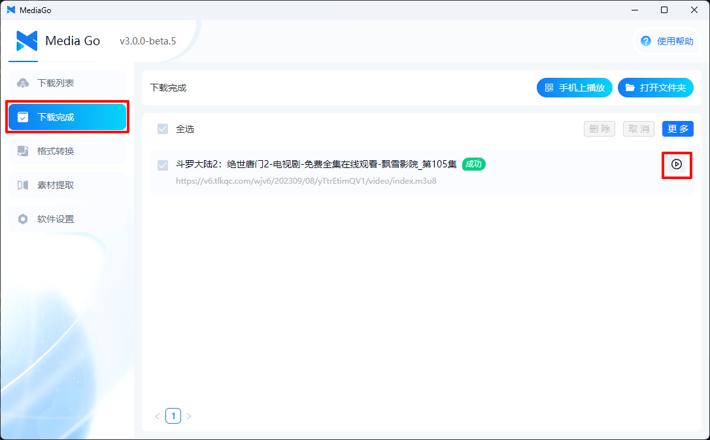

# 快速开始

这篇文章是软件的简单说明，可以快速上手使用本本软件。

::: tip
我建了一个 QQ 群，方便大家一起沟通交流： 574209001
:::

## 下载安装

**v2.0.1（2023.7.1 发布）**

- [windows mediago v2.0.1](https://github.com/caorushizi/mediago/releases/download/v2.0.1/media-downloader-setup-2.0.1.exe)
- [macos mediago v2.0.1](https://github.com/caorushizi/mediago/releases/download/v2.0.1/media-downloader-setup-2.0.1.dmg)

**更新日志**

- 暗黑模式
- 更多下载配置
- 支持请求标头自动带入
- 支持开启广告过滤
- 支持开启沉浸式嗅探
- 支持切换手机和 PC 模式
- 支持修改同时下载数量
- 修复了一些 bug

**v1.1.5（2022.2.5 发布）**

- [windows mediago v1.1.5](https://github.com/caorushizi/mediago/releases/download/1.1.5/media-downloader-setup-1.1.4.exe)

**更新日志**

- 支持视频下载

## 操作说明

### 视频自动嗅探

1. 选择【资源提取】

   

2. 进入视频的网址

   

3. 开始下载，即可下载视频

   

### 手动下载

1. 点击页面右上角的【新建下载】

   

2. 在新建下载弹窗中填入【视频名称】和【m3u8 地址】即可

   

3. 在列表中点击下载，即可下载视频

   

## 附加功能

1. 下载完成后可以在下载列表中点击转换音频按钮将视频转换为音频

   

2. 下载完成后播放视频

   - PC 播放

     

   - 移动端播放

     

3. 批量下载

   

## 开始你的视频下载吧

是不是很简单，快去下载你的视频吧

::: warning
本软件仅可用于学习交流
:::
