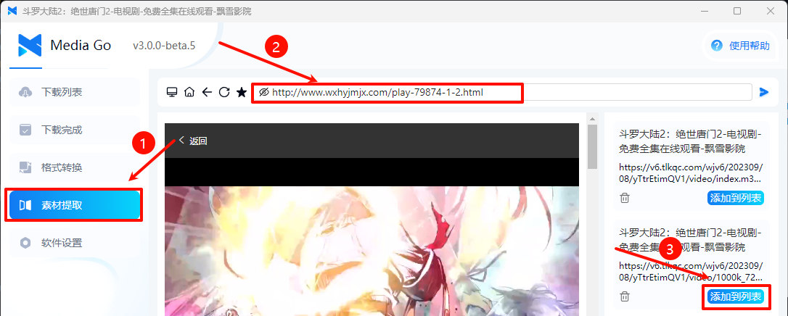
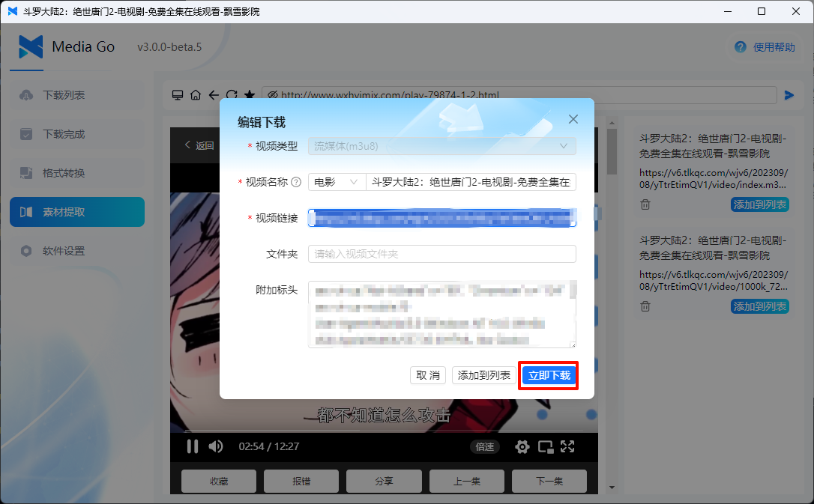
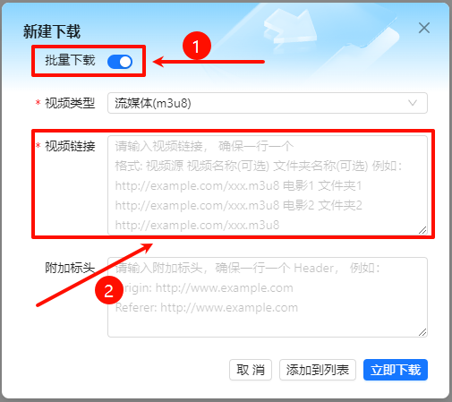

# 快速开始

这篇文章是软件的简单说明，可以快速上手使用本软件。

::: tip
方便大家一起沟通交流， 可以加入反馈群：

MediaGo QQ反馈群： 574209001

v3.x.x 是最新版本，大家的意见可以尽量在 3.x.x 版本中提出，我们会尽快修复。

:::

## 下载安装

### v3.0.1 (2025.1.14 发布)

::: tip
国内用户可以通过网盘下载

阿里网盘：
<https://www.alipan.com/s/SwCbQBN2nZQ>

百度网盘：
<https://pan.baidu.com/s/1CLqPKZ4_lwewb2L4wre_eA?pwd=rmdn>

:::

- [【mediago】 windows(安装版) v3.0.1](https://github.com/caorushizi/mediago/releases/download/v3.0.1/mediago-setup-win32-x64-3.0.1.exe)
- [【mediago】 windows(便携版) v3.0.1](https://github.com/caorushizi/mediago/releases/download/v3.0.1/mediago-portable-win32-x64-3.0.1.exe)
- [【mediago】 macos arm64（apple 芯片） v3.0.1](https://github.com/caorushizi/mediago/releases/download/v3.0.1/mediago-setup-darwin-arm64-3.0.1.dmg)
- [【mediago】 macos x64（intel 芯片） v3.0.1](https://github.com/caorushizi/mediago/releases/download/v3.0.1/mediago-setup-darwin-x64-3.0.1.dmg)
- [【mediago】 linux v3.0.1](https://github.com/caorushizi/mediago/releases/download/v3.0.1/mediago-setup-linux-amd64-3.0.1.deb)
- 【mediago】 docker v3.0 `docker run -d --name mediago -p 8899:8899 -v /root/mediago:/root/mediago registry.cn-beijing.aliyuncs.com/caorushizi/mediago:v3.0.0`

## 操作说明

### 视频自动嗅探

1. 选择【资源提取】

   

2. 进入视频的网址

   

3. 点击【立即下载】，即可下载视频

   

### 手动下载

1. 点击页面右上角的【新建下载】

   

2. 在新建下载弹窗中填入【视频名称】和【流媒体（m3u8）】或者【哔哩哔哩】即可

   

3. 在列表中点击下载，即可下载视频

   

### 批量下载

   

### 附加功能

1. 转换为音频

   

2. 后续会增加更多功能，敬请期待~

### 播放视频

- PC 播放

     

- 移动端播放

     

## 开始你的视频下载吧

是不是很简单，快去下载你的视频吧

::: warning
本软件仅可用于学习交流
:::
