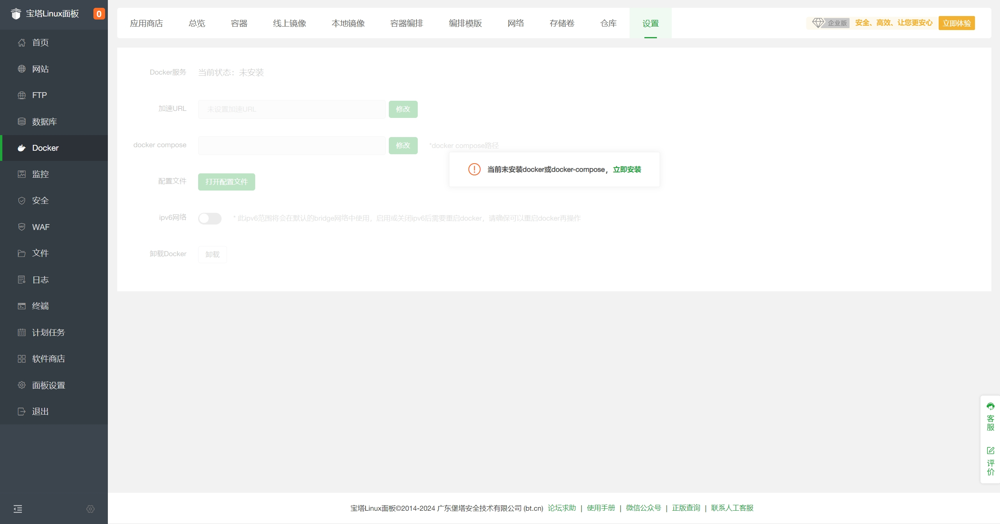
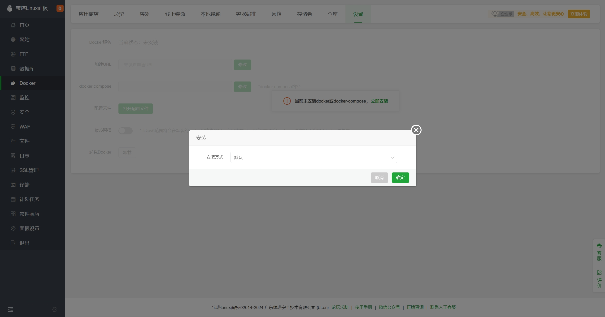
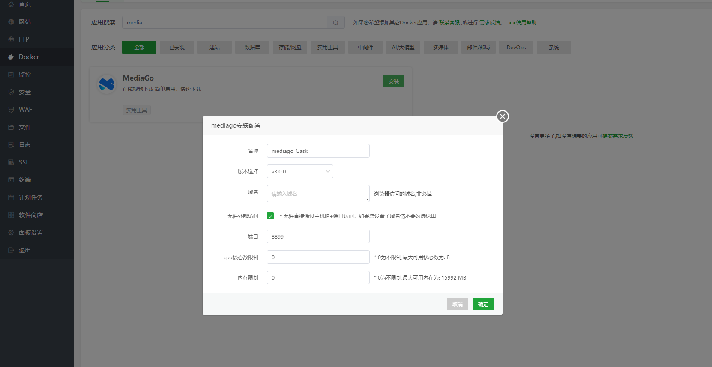

# Deploy con BT Panel

Questo documento spiega come distribuire `MediaGo` usando `BT Panel`.

## Prerequisiti

- Applicabile solo a BT Panel versione 9.2.0 o superiore
- Installa BT Panel dal [sito ufficiale BT Panel](https://www.bt.cn/new/download.html?r=dk_mediago), scegliendo lo script della versione stabile

## Deploy

1. Accedi a BT Panel e clicca `Docker` nel menu a sinistra

   

2. Al primo accesso verrà richiesto di installare i servizi `Docker` e `Docker Compose`. Clicca "Installa ora"; se sono già installati, ignora il passaggio.

   

3. Dopo l'installazione, vai in `Docker - App Store`, trova `MediaGo` e clicca `Install`

   

4. Dopo l'invio, il pannello inizializza automaticamente l'applicazione. Potrebbero servire 1-3 minuti; al termine potrai accedervi.

- Porta: 8899
- Versione: v3.0.0

## Accedere a MediaGo

Inserisci il dominio o l'indirizzo `http://<IP BT Panel>:8899` nella barra del browser per aprire la console di `MediaGo`.
