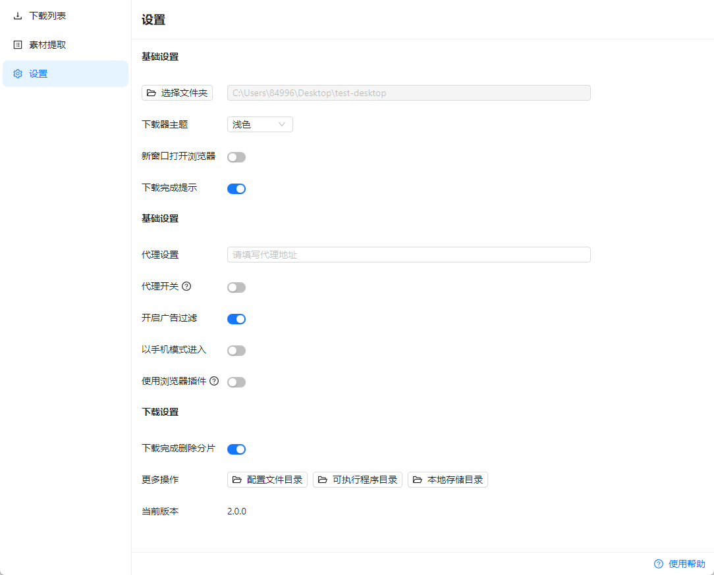
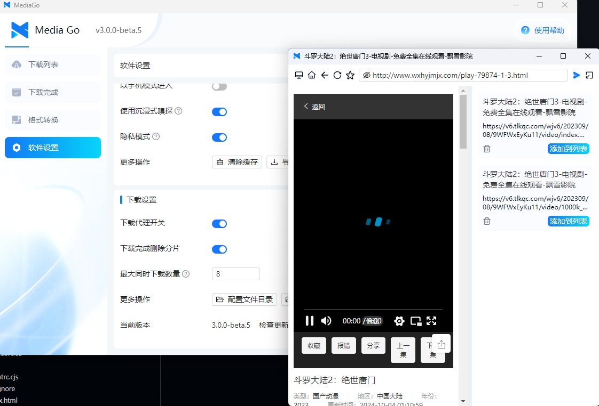
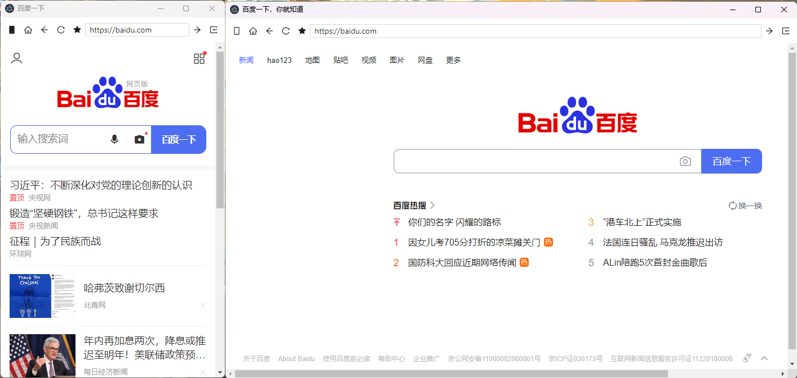
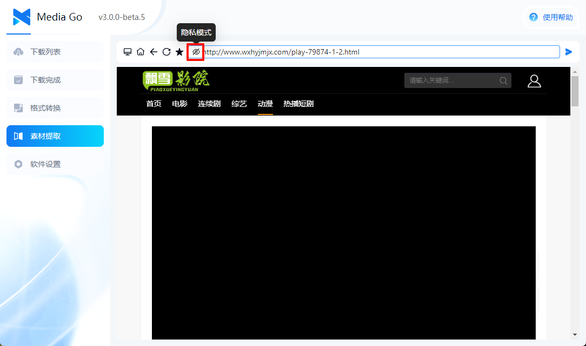
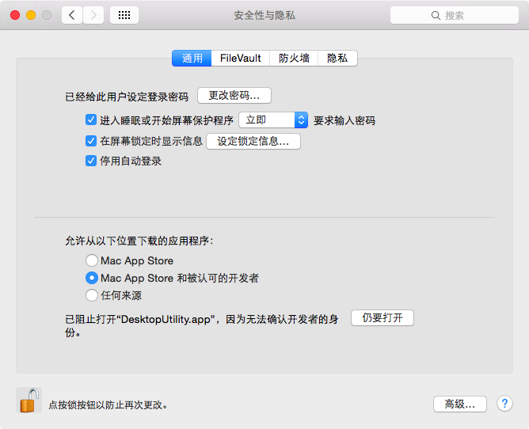

# Guida utente

Questa pagina spiega principalmente il significato dei parametri nella pagina
delle impostazioni.

## Impostazioni di base

::: tip
Impostazioni globali del downloader
:::

### 1. Scegli cartella

Il percorso in cui scaricare i video.

### 2. Tema downloader

Supporta modalità chiara e scura.

### 3. Lingua di visualizzazione

Supporta cinese, inglese e italiano.

### 4. Notifica di completamento download

Se abilitata, il sistema mostra una notifica al termine del download.

### 5. Mostra console

Se abilitata, viene mostrata la console del download.

### 6. Aggiornamento automatico

Se abilitato, il software controllerà automaticamente la disponibilità di aggiornamenti.

### 7. Consenti aggiornamenti a versioni di test

Se abilitato, il software controllerà automaticamente anche le versioni di test.

### 8. Chiusura finestra principale

Controlla se il software deve "nascondersi nella tray di sistema" o "uscire dal software" quando la finestra principale viene chiusa.

## Impostazioni browser

::: tip
Impostazioni relative alla finestra del browser
:::

### 1. Apri browser in una nuova finestra

Se abilitato, la pagina del browser viene aperta in una finestra separata.

### 2. Impostazioni proxy

Inserisci il tuo indirizzo proxy.

### 3. Interruttore proxy

Se abilitato, il **browser** usa l'indirizzo proxy inserito. Se l'interruttore proxy è disabilitato, questa impostazione non sarà disponibile.

### 4. Abilita blocco annunci

Se abilitato, gli annunci nella pagina vengono filtrati.

### 5. Usa modalità mobile

Se abilitato, il browser simula un browser mobile e richiede la versione mobile del sito.

### 6. Usa sniffing immersivo

- **Abilitato**: le risorse rilevate dal browser non vengono aggiunte automaticamente alla lista download; devi cliccare manualmente "Aggiungi alla lista" nella pagina.

  

- **Disabilitato**: le risorse rilevate dal browser vengono aggiunte automaticamente alla lista download.

### 7. Modalità privacy

Se abilitata, il software non salva la cronologia di navigazione.

### 8. Altre operazioni

- Cancella cache: cancella la cache del software.
- Esporta preferiti [Importa preferiti]: esporta i preferiti del software.

## Impostazioni download

::: tip
Impostazioni relative ai download
:::

### 1. Interruttore proxy download

Se abilitato, il **downloader** usa l'indirizzo proxy inserito. Le impostazioni proxy del **browser** e del **downloader** sono indipendenti.

### 2. Elimina file parziali al completamento

Se abilitato, i file parziali vengono eliminati al termine del download.

### 3. Download simultanei massimi

Controlla quanti file video possono essere scaricati contemporaneamente. Il massimo è 10, il minimo è 1.

### 4. Altre operazioni

- Directory file di configurazione: percorso del database, dei log e degli altri dati del software.
- Directory file eseguibili: percorso dei binari del downloader.
- Percorso archiviazione locale: percorso locale in cui vengono salvati i video scaricati.

### 5. Versione corrente

Mostra la versione corrente del software.

## Altri problemi

### D: Download di live stream

R: Il software supporta i download di live stream. Al momento non esiste un metodo affidabile per distinguerli, quindi tutte le console di download vengono abilitate. L'utente deve selezionare manualmente la sorgente dati da scaricare.

### D: Versione macOS

R: Per **chip Intel**, devi installare la versione x64 dalla release.

Dopo l'installazione, devi consentire l'apertura dell'app nelle impostazioni Sicurezza di macOS.

Per **chip Apple**, devi installare la versione arm64 dalla release.

Dopo l'installazione, esegui il comando `sudo xattr -dr com.apple.quarantine /Applications/mediago.app` nella console.

### D: Versioni precedenti

R: La versione 1.1.5 è stata rilasciata tempo fa ed è stata verificata come stabile da molti utenti. Se vuoi usare la vecchia versione, visita [questo link](/it/history.html).

### D: Utenti Windows 7

R: Le versioni successive alla v2.0.0 non supportano più Windows 7. Se devi usare il software su Windows 7, scarica la versione 1.1.5. I sistemi a 32 bit non sono supportati per impostazione predefinita.
