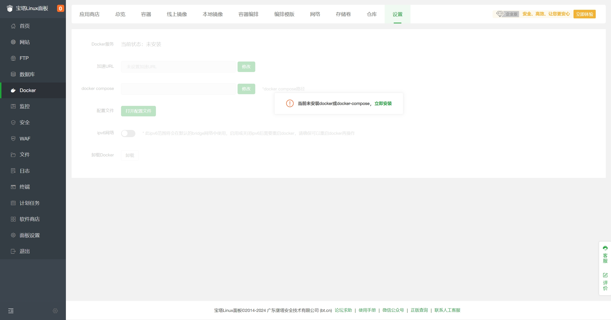
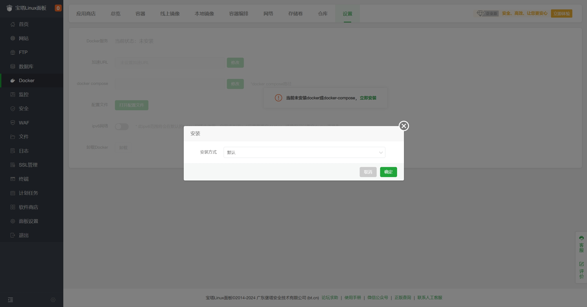
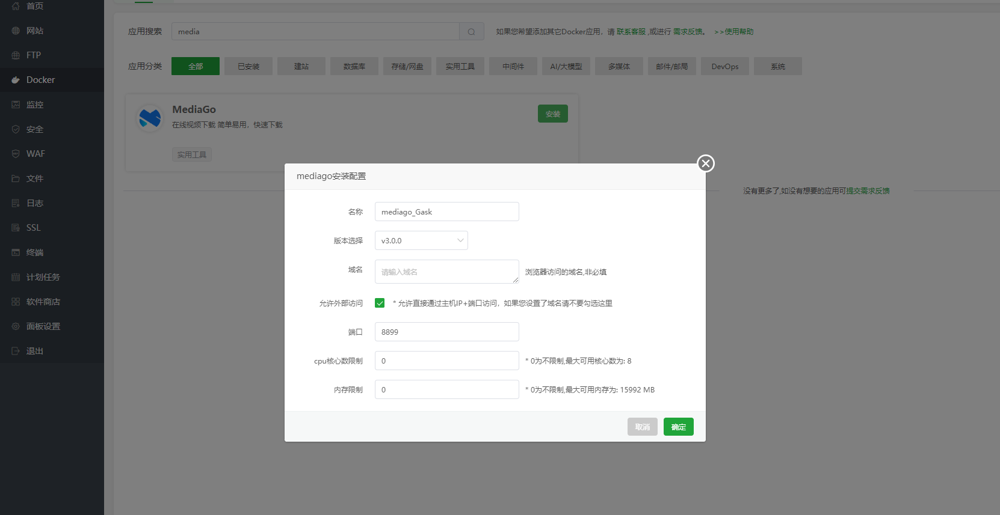

---
layout: doc  
outline: deep  
---  

# 宝塔パネルを使ったデプロイ

この記事では、`宝塔パネル`を使用して`MediaGo`をデプロイする方法を紹介します。

## 前提条件

- 宝塔パネル 9.2.0 以上のバージョンのみ対応
- 宝塔パネルをインストールするには、[宝塔パネル公式サイト](https://www.bt.cn/new/download.html?r=dk_mediago)にアクセスし、正式版のスクリプトを選んでインストールしてください。

## デプロイ

1. 宝塔パネルにログインし、左側のメニューで`Docker`をクリックします。  
   

2. 初回は`Docker`と`Docker Compose`サービスのインストールが求められます。`今すぐインストール`をクリックし、すでにインストールされている場合は無視してください。  
   

3. インストール後、`Docker-アプリストア`で`MediaGo`を探し、`インストール`をクリックします。  
   

4. 提出後、パネルは自動でアプリケーションの初期化を行い、1～3分ほどで完了します。初期化が完了するとアクセス可能になります。

- ポート： 8899
- バージョン選択： v3.0.0

## MediaGoへのアクセス

ブラウザのアドレスバーに`http://<宝塔パネルIP>:8899`を入力して、`MediaGo`のコントロールパネルにアクセスします。
