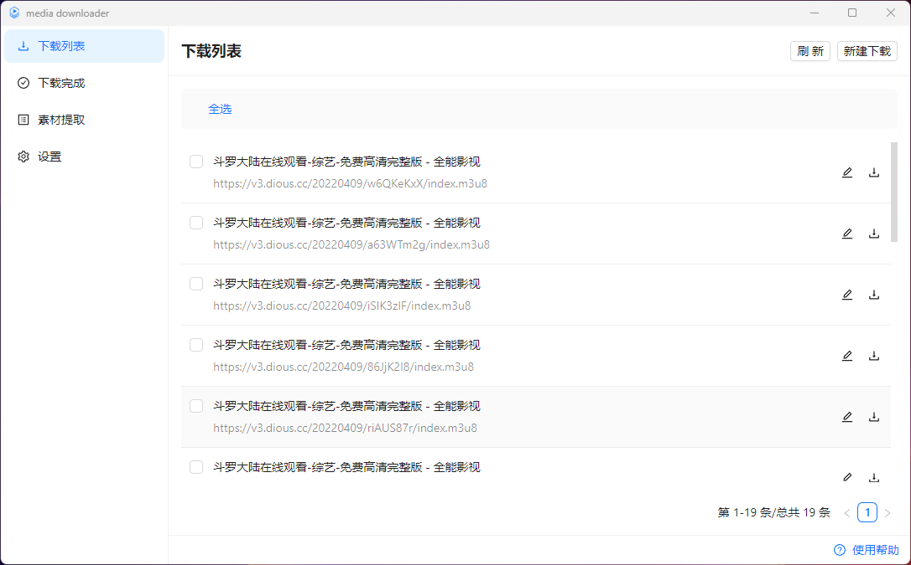
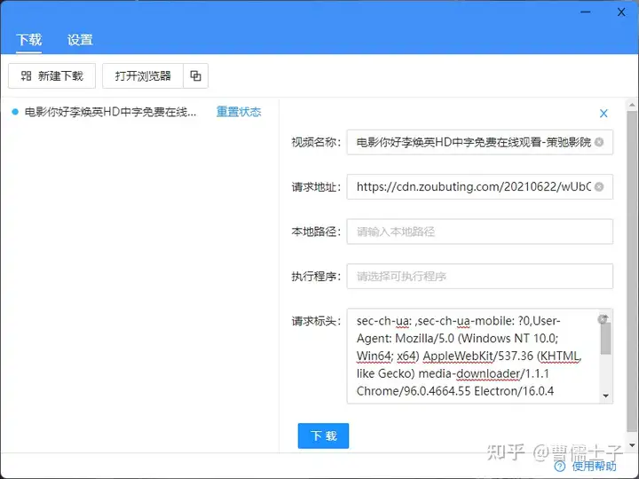

---
layout: doc  
outline: deep  
---  

# 更新ログ

## v3.0.0 (2024.10.7 リリース)

### ソフトウェアダウンロード

- [【mediago】 windows(インストーラ版) v3.0.0](https://github.com/caorushizi/mediago/releases/download/v3.0.0/mediago-setup-win32-x64-3.0.0.exe)
- [【mediago】 windows(ポータブル版) v3.0.0](https://github.com/caorushizi/mediago/releases/download/v3.0.0/mediago-portable-win32-x64-3.0.0.exe)
- [【mediago】 macos arm64（Appleチップ） v3.0.0](https://github.com/caorushizi/mediago/releases/download/v3.0.0/mediago-setup-darwin-arm64-3.0.0.dmg)
- [【mediago】 macos x64（Intelチップ） v3.0.0](https://github.com/caorushizi/mediago/releases/download/v3.0.0/mediago-setup-darwin-x64-3.0.0.dmg)
- [【mediago】 linux v3.0.0](https://github.com/caorushizi/mediago/releases/download/v3.0.0/mediago-setup-linux-amd64-3.0.0.deb)
- 【mediago】 docker v3.0 `docker run -d --name mediago -p 8899:8899 -v /root/mediago:/root/mediago registry.cn-beijing.aliyuncs.com/caorushizi/mediago:v3.0.0`

### 国内ダウンロード

- [【mediago】 windows(インストーラ版) v3.0.0](https://static.ziying.site/mediago/mediago-setup-win32-x64-3.0.0.exe)
- [【mediago】 windows(ポータブル版) v3.0.0](https://static.ziying.site/mediago/mediago-portable-win32-x64-3.0.0.exe)
- [【mediago】 macos arm64（Appleチップ） v3.0.0](https://static.ziying.site/mediago/mediago-setup-darwin-arm64-3.0.0.dmg)
- [【mediago】 macos x64（Intelチップ） v3.0.0](https://static.ziying.site/mediago/mediago-setup-darwin-x64-3.0.0-beta.5.dmg)
- [【mediago】 linux v3.0.0](https://static.ziying.site/mediago/mediago-setup-linux-amd64-3.0.0.deb)
- 【mediago】 docker v3.0 `docker run -d --name mediago -p 8899:8899 -v /root/mediago:/root/mediago registry.cn-beijing.aliyuncs.com/caorushizi/mediago:v3.0.0`

### ソフトウェアスクリーンショット

### 重要な更新

- dockerを使用したWeb端のデプロイをサポート
- デスクトップUIの更新

### 更新ログ

- デスクトップUIの更新
- dockerを使用したWeb端のデプロイをサポート
- 新たに動画再生機能が追加、デスクトップ端とモバイル端で再生可能
- Macで開けない問題を修正
- バッチダウンロードのインタラクションを最適化
- Windows用のポータブル版を追加（インストール不要）
- ダウンロードリストの最適化、ページ内複数の動画を嗅探
- コレクションリストの手動インポート/エクスポートをサポート
- ホームページのダウンロードリストのエクスポートをサポート
- 新規ダウンロードフォームのインタラクションロジックの最適化
- UrlSchemeを使用してアプリを開き、ダウンロードタスクを追加
- 一部のバグを修正し、ユーザーエクスペリエンスを向上

## v2.2.3 (2024.7.06 リリース)

### ダウンロードリンク

- [windows mediago v2.2.3](https://github.com/caorushizi/mediago/releases/download/v2.2.3/mediago-setup-x64-2.2.3.exe)
- [macos mediago v2.2.3](https://github.com/caorushizi/mediago/releases/download/v2.2.3/mediago-setup-x64-2.2.3.dmg)
- [linux mediago v2.2.3](https://github.com/caorushizi/mediago/releases/download/v2.2.3/mediago-setup-arm64-2.2.3.dmg)

### 更新ログ

- 設定に【自動更新】スイッチを追加：release版のみ更新、beta版は自動更新されません
- ダウンロードフォームに【バッチ更新】を追加
- Linux版を新たにリリース
- ダウンロード時に最も高解像度の動画を自動選択
- 【キャッシュクリア】＆【シークレットモード】を追加
- インストール場所をカスタマイズ選択可能
- 一部のバグを修正

## v2.2.0 (2024.5.22 リリース)

### ダウンロードリンク

- [windows mediago v2.2.0](https://github.com/caorushizi/mediago/releases/download/v2.2.0/mediago-setup-2.2.0.exe)
- [macos mediago v2.2.0](https://github.com/caorushizi/mediago/releases/download/v2.2.0/mediago-setup-2.2.0.dmg)

### 更新ログ

- ライブストリームのダウンロードをサポート
- ビリビリ動画ダウンロードをサポート
- 没入型嗅探プロセスを最適化
- ダウンロードコントロールの出力をサポート
- 一部のバグを修正

## v2.0.1（2023.7.1 リリース）

### ダウンロードリンク

- [windows mediago v2.0.1](https://github.com/caorushizi/mediago/releases/download/v2.0.1/media-downloader-setup-2.0.1.exe)
- [macos mediago v2.0.1](https://github.com/caorushizi/mediago/releases/download/v2.0.1/media-downloader-setup-2.0.1.dmg)

### ソフトウェアスクリーンショット

### 更新ログ

- ダークモード
- 追加のダウンロード設定
- リクエストヘッダーの自動挿入をサポート
- 広告フィルタリングをサポート
- 没入型嗅探機能をサポート
- モバイルモードとPCモードの切り替えをサポート
- 同時ダウンロード数の変更をサポート
- 一部のバグを修正

## v1.1.5（2022.2.5 リリース）

### ダウンロードリンク

- [windows mediago v1.1.5](https://github.com/caorushizi/mediago/releases/download/1.1.5/media-downloader-setup-1.1.4.exe)

### ソフトウェアスクリーンショット

### 更新ログ

- 動画ダウンロードをサポート

## v1.0.1（2021.3.1 リリース）

### ソフトウェアスクリーンショット

### 更新ログ

- 動画ダウンロードをサポート
