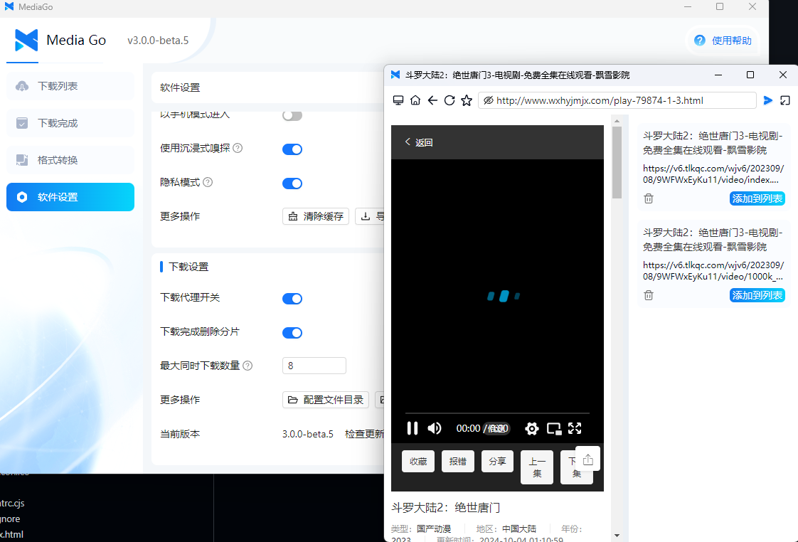
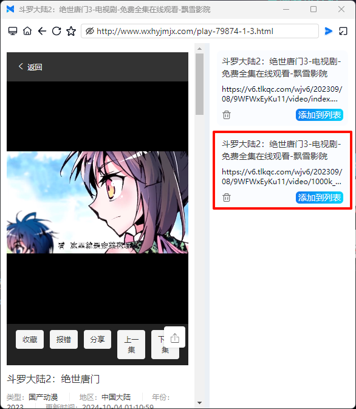

---
layout: doc  
outline: deep  
---  

# 使用方法

このページでは、設定ページのパラメーターの意味について説明します。

## 基本設定

::: tip  
ダウンローダーのグローバル設定  
:::

### 1. フォルダの選択

動画のダウンロード先のパスを設定します。

### 2. ダウンローダーのテーマ

ライトモードとダークモードをサポートしています。

### 3. 表示言語

中国語と英語がサポートされています。

### 4. ダウンロード完了通知

これをオンにすると、ダウンロード完了時にシステム通知が表示されます。

### 5. コンソールの表示

これをオンにすると、ダウンロードコンソールが表示されます。

### 6. 自動更新

これをオンにすると、ソフトウェアは自動的に更新をチェックします。

### 7. テストバージョンのアップグレードを許可

これをオンにすると、ソフトウェアは自動的にテストバージョンをチェックします。

### 8. メインウィンドウを閉じる

メインウィンドウを閉じた後、ソフトウェアを【システムトレイに隠す】か【ソフトウェアを終了】するかを設定します。

## ブラウザ設定

::: tip  
ブラウザウィンドウに関連する設定  
:::

### 1. 新しいウィンドウでブラウザを開く

これをオンにすると、ブラウザページが独立したウィンドウで開きます。

### 2. プロキシ設定

自分のプロキシアドレスを入力します。

### 3. プロキシスイッチ

スイッチをオンにすると、**ブラウザ**はデフォルトで指定されたプロキシアドレスを使用します。このスイッチがオフの場合、ブラウザのプロキシは設定できません。

### 4. 広告フィルタリングを有効にする

スイッチをオンにすると、ページ内の広告がフィルタリングされます。

### 5. モバイルモードで入る

これをオンにすると、ブラウザがモバイルブラウザに偽装され、モバイルサイトを要求します（左側はモバイルモードを有効にしたスクリーンショットです）。

### 6. 没入型嗅探を使用

- 有効状態：ブラウザから嗅探されたリソースは自動的にダウンロードリストに追加されず、ページ内の【リストに追加】ボタンをクリックする必要があります。

  

- 無効状態：ブラウザから嗅探されたリソースは自動的にダウンロードリストに追加されます。

### 7. プライバシーモード： 有効にすると、ソフトウェアはユーザーのブラウジング履歴を保存しません

### 8. その他の操作

- キャッシュをクリア： ソフトウェアのキャッシュをクリアします。
- お気に入りのエクスポート【インポート】： ソフトウェアのお気に入りをエクスポートします。

## ダウンロード設定

::: tip  
ダウンロードに関連する設定  
:::

### 1. ダウンロードプロキシスイッチ

スイッチをオンにすると、**ダウンローダー**はデフォルトで指定されたプロキシアドレスを使用します。**ブラウザ**と**ダウンローダー**のプロキシは独立しています。

### 2. ダウンロード完了後、分割ファイルを削除

これをオンにすると、ダウンロードが完了した後に分割ファイルが削除されます。

### 3. 最大同時ダウンロード数

最大で同時にダウンロードできる動画ファイルの数を設定します。現在の最大値は10、最小値は1です。

### 4. その他の操作

- 設定ファイルのディレクトリ： ソフトウェアのデータベースパス、ログなどのパスを設定します。
- 実行可能ファイルのディレクトリ： ダウンローダーのバイナリファイルのパスを設定します。
- ローカルストレージパス： ダウンロードした動画のローカルパスを設定します。

### 5. 現在のバージョン

現在使用しているソフトウェアのバージョン情報が表示されます。

## その他の質問

### Q: ライブ動画のダウンロードについて

A: ソフトウェアはライブのダウンロードをサポートしていますが、現時点ではライブストリームを区別する方法がないため、すべてのダウンロードコンソールを開くようにしています。ユーザー自身でダウンロードするデータソースを識別してください。

### Q: MacOS版について

A: 【Intelチップ】の場合、リリース版のx64バージョンをインストールする必要があります。インストール後、Macのセキュリティ設定で「不明な開発元からのアプリケーションを開く」設定を有効にしてください。

【Appleチップ】の場合、リリース版のarm64チップ用バージョンをインストールする必要があります。インストール後、コンソールで `sudo xattr -dr com.apple.quarantine /Applications/mediago.app` コマンドを実行してください。

### Q: 古いバージョンについて

A: バージョン1.1.5は長期間にわたりリリースされ、多くのユーザーによって検証されていますので、比較的安定しています。古いバージョンを使用したい場合は、[こちらのリンク](/history.html)からアクセスしてください。

### Q: Win7ユーザーについて

A: v2.0.0以降のバージョンはWin7をサポートしていません。Win7で使用する場合は、バージョン1.1.5をダウンロードする必要があります。32ビットシステムは現在、デフォルトでサポートされていません。
