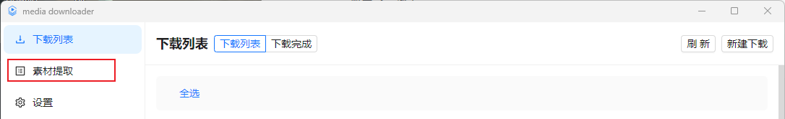
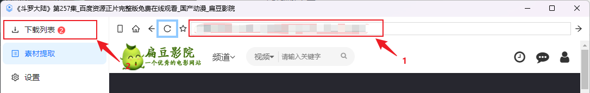
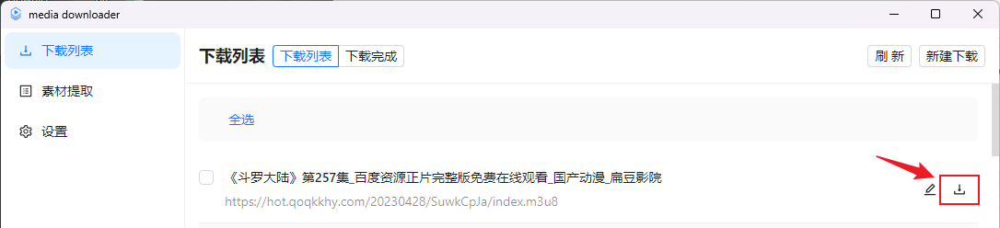
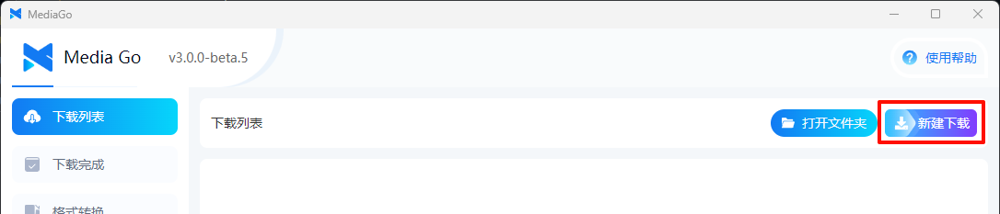
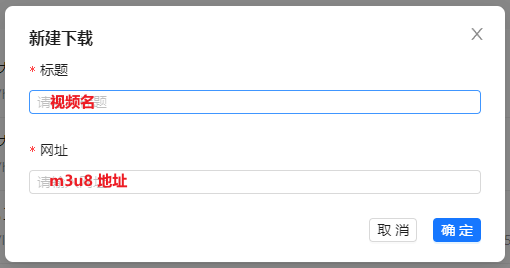
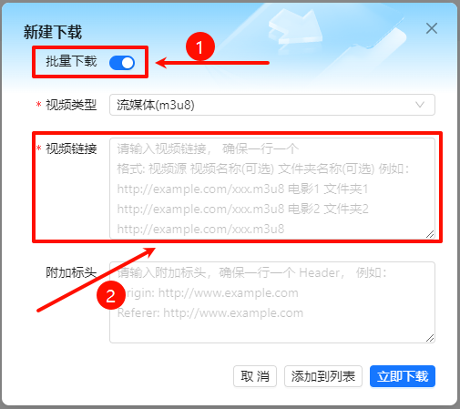
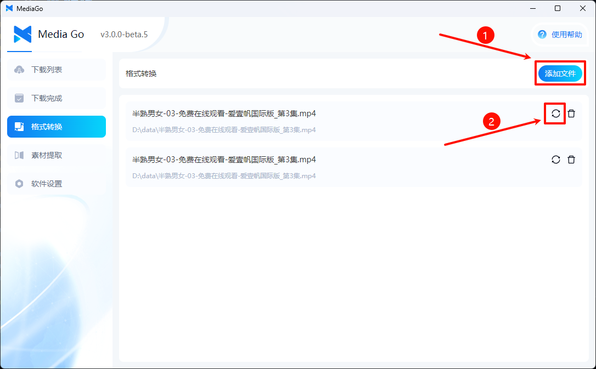
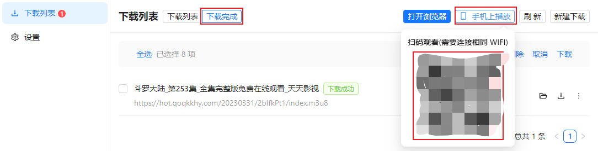
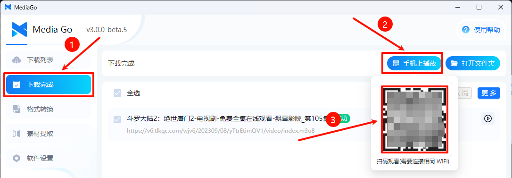

# クイックスタート

この記事では、ソフトウェアの簡単な説明を行い、すぐに使用できるようにします。[OpenClaw Skill](/jp/skills) に対応し、AI アシスタントで自然言語を使って動画をダウンロードできます。

::: tip  
皆さんがより便利にコミュニケーションできるよう、フィードバックグループに参加できます：

MediaGo QQフィードバックグループ 1： 574209001

:::

::: info  
v3.5 が最新バージョンです。ご意見はできるだけこのバージョンでお寄せください。できるだけ早く対応します。  
:::

## ダウンロードとインストール

### v3.5.0 (2026年4月22日リリース)

#### ソフトウェアのダウンロード

- [【mediago】 Windows（インストーラー版） v3.5.0](https://github.com/caorushizi/mediago/releases/download/v3.5.0/mediago-community-setup-win32-x64-3.5.0.exe)
- [【mediago】 Windows（ポータブル版） v3.5.0](https://github.com/caorushizi/mediago/releases/download/v3.5.0/mediago-community-portable-win32-x64-3.5.0.exe)
- [【mediago】 macOS arm64（Apple Silicon） v3.5.0](https://github.com/caorushizi/mediago/releases/download/v3.5.0/mediago-community-setup-darwin-arm64-3.5.0.dmg)
- [【mediago】 macOS x64（Intel） v3.5.0](https://github.com/caorushizi/mediago/releases/download/v3.5.0/mediago-community-setup-darwin-x64-3.5.0.dmg)
- [【mediago】 Linux v3.5.0](https://github.com/caorushizi/mediago/releases/download/v3.5.0/mediago-community-setup-linux-amd64-3.5.0.deb)
- 【mediago】 Docker v3.5.0 `docker run -d --name mediago -p 8899:8899 -v /path/to/mediago:/app/mediago ghcr.io/caorushizi/mediago:3.5.0`

過去のバージョンは [GitHub Releases ページ](https://github.com/caorushizi/mediago/releases) をご覧ください。

#### 主な新機能

- **ブラウザ拡張機能** (Chrome / Edge) — 任意のサイトで動画をワンクリックスニッフィング
- **YouTube と 1000+ サイト** — yt-dlp による対応
- **OpenClaw Skill** — AI コーディングアシスタント経由でのダウンロード
- **HTTP API** — スクリプト・自動化・サードパーティツールとの統合
- **アプリ内フォーマット変換** — ダウンロード完了後に出力形式と画質を選択
- **Docker デプロイの簡素化** — GHCR のマルチアーキテクチャイメージ、単一ディレクトリのマウント
- **起動の高速化** — バックエンドを Go で書き直し、メモリ使用量の削減、内蔵動画プレーヤー

## 操作方法

### 動画の自動嗅探

1. 【リソース抽出】を選択

   

2. 動画のURLにアクセス

   

3. 【今すぐダウンロード】をクリックすると、動画がダウンロードされます

   

### 手動ダウンロード

1. ページ右上の【新規ダウンロード】をクリック

   

2. 新規ダウンロードのポップアップウィンドウに【動画の名前】と【ストリーミング（m3u8）】または【Bilibili】を入力

   

3. リスト内でダウンロードをクリックして、動画をダウンロードします

   

### バッチダウンロード

### 追加機能

1. 音声に変換

   

2. さらに多くの機能が追加される予定です。お楽しみに~

### 動画の再生

- PC再生

  

- モバイル端末再生

  

## 動画ダウンロードを始めましょう

簡単ですよね。さあ、動画をダウンロードし始めましょう！

::: warning  
このソフトウェアは学習と交流目的でのみ使用できます。  
:::
