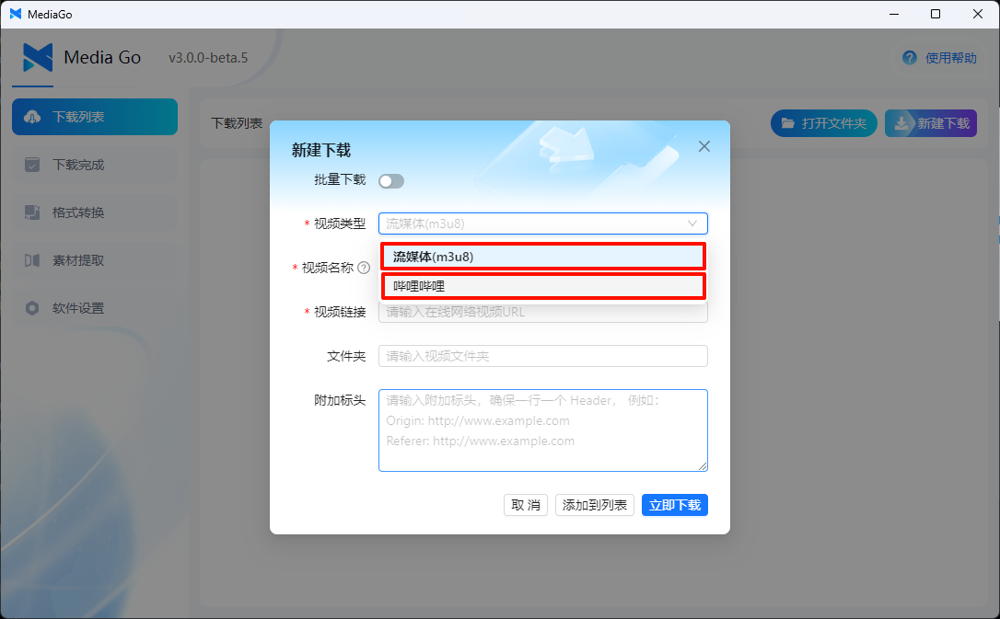
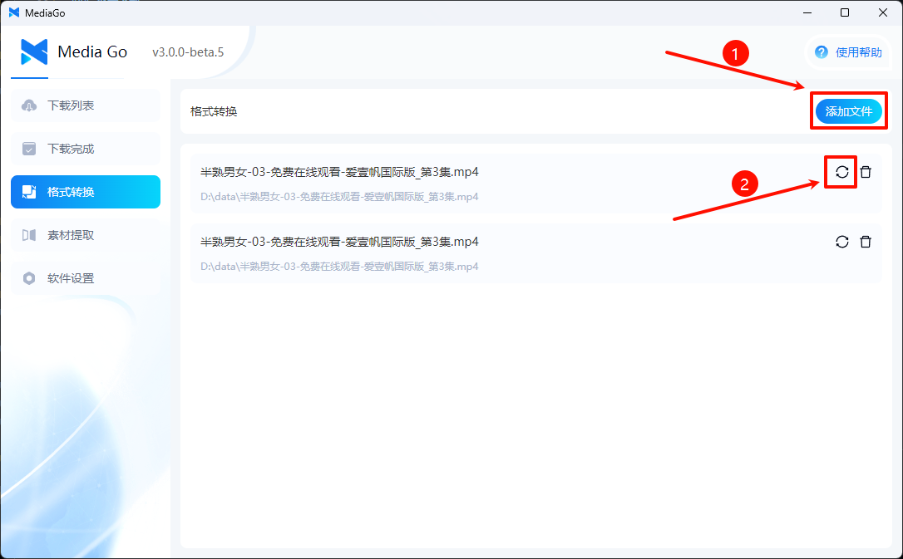

---
layout: doc  
outline: deep  
---  

# クイックスタート

この記事では、ソフトウェアの簡単な説明を行い、すぐに使用できるようにします。

::: tip  
皆さんがより便利にコミュニケーションできるよう、フィードバックグループに参加できます：

MediaGo QQフィードバックグループ 1： 574209001

:::

::: info  
v3.0 は最新バージョンです。皆さんの意見はできるだけ3.0バージョンでお寄せください。私たちはできるだけ早く修正します。  
:::

## ダウンロードとインストール

### v3.0.0 (2024年10月7日リリース)

#### ソフトウェアのダウンロード

- [【mediago】 windows（インストール版） v3.0.0](https://github.com/caorushizi/mediago/releases/download/v3.0.0/mediago-setup-win32-x64-3.0.0.exe)
- [【mediago】 windows（ポータブル版） v3.0.0](https://github.com/caorushizi/mediago/releases/download/v3.0.0/mediago-portable-win32-x64-3.0.0.exe)
- [【mediago】 macos arm64（Appleチップ） v3.0.0](https://github.com/caorushizi/mediago/releases/download/v3.0.0/mediago-setup-darwin-arm64-3.0.0.dmg)
- [【mediago】 macos x64（Intelチップ） v3.0.0](https://github.com/caorushizi/mediago/releases/download/v3.0.0/mediago-setup-darwin-x64-3.0.0.dmg)
- [【mediago】 linux v3.0.0](https://github.com/caorushizi/mediago/releases/download/v3.0.0/mediago-setup-linux-amd64-3.0.0.deb)
- 【mediago】 docker v3.0 `docker run -d --name mediago -p 8899:8899 -v /root/mediago:/root/mediago registry.cn-beijing.aliyuncs.com/caorushizi/mediago:v3.0.0`

#### 重要な更新内容

- DockerでWeb端末の展開をサポート
- デスクトップ端末UIを更新

#### 更新ログ

- DockerでWeb端末の展開をサポート
- デスクトップ端末UIを更新
- 動画再生機能を追加、デスクトップとモバイル端末両方で再生可能
- macで画面が表示されない問題を修正
- バッチダウンロードのインタラクションを最適化
- Windows用ポータブル版（インストール不要）を追加
- ダウンロードリストを最適化し、ページ内の複数の動画の嗅探をサポート
- お気に入りリストの手動インポート/エクスポートをサポート
- ホームページのダウンロードリストエクスポートをサポート
- 【新規ダウンロード】フォームのインタラクションロジックを最適化
- UrlSchemeを使用してアプリを開き、ダウンロードタスクを追加
- バグの修正とユーザーエクスペリエンスの向上

## 操作方法

### 動画の自動嗅探

1. 【リソース抽出】を選択

   

2. 動画のURLにアクセス

   

3. 【今すぐダウンロード】をクリックすると、動画がダウンロードされます

   

### 手動ダウンロード

1. ページ右上の【新規ダウンロード】をクリック

   

2. 新規ダウンロードのポップアップウィンドウに【動画の名前】と【ストリーミング（m3u8）】または【Bilibili】を入力

   

3. リスト内でダウンロードをクリックして、動画をダウンロードします

   

### バッチダウンロード

   

### 追加機能

1. 音声に変換

   

2. さらに多くの機能が追加される予定です。お楽しみに~

### 動画の再生

- PC再生

     

- モバイル端末再生

     

## 動画ダウンロードを始めましょう

簡単ですよね。さあ、動画をダウンロードし始めましょう！

::: warning  
このソフトウェアは学習と交流目的でのみ使用できます。  
:::
