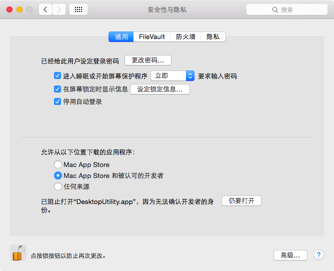

# 其他问题

## Q: 关于直播视频的下载

A: 软件支持直播下载，软件目前没有好的办法区分直播流，所以将所有的下载控制台开启。用户自行分辨下载数据源

## Q: 关于 MacOS 版本

A: 【Intel 芯片】需要安装 release 中的 x64 版本。

安装完成后需要在 Mac 的安全设置中打开来自身份不明开发者的 Mac App

【Apple 芯片】需要安装 release 中的 arm64 芯片

安装完成后需要在控制台执行 `sudo xattr -dr com.apple.quarantine /Applications/mediago.app` 命令

## Q: 关于旧版本

A: 1.1.5 版本确实发布了很长时间，经过大量用户的验证，比较稳定。所以想要使用旧版软件的话请访问[此链接](/history.html)

## Q: 关于 Win7 用户

A: v2.0.0 之后的版本已经放弃不支持 Win7 如果需要在 win7 上面使用同样需要下载 1.1.5 版本。如果是 32 位系统，目前默认不支持。
